# ARCHITECTURE: how Hera fits together

> Explanation · for maintainers · assumes you've skimmed the [README](../README.md) and know the vocabulary (vault, page, ULID, hook, citation).
> Nature: **Living doc.** Source of truth for the system-level map. For the decisions and invariants behind the shape, see [DECISIONS.md](DECISIONS.md).

This is the map to read before touching anything. It gives you the mental model in one paragraph, one topology diagram, and one lifecycle trace, then hands you down to the detailed docs. If you're mid-refactor and asking "can I touch this?", start at [§5 Hard invariants](#5-hard-invariants) and [§6 Where to look when it breaks](#6-where-to-look-when-it-breaks).

---

## 1. The mental model (read this first)

Hera is a **retrieval-and-ranking loop** wrapped around a Markdown vault. You (or an automatic engine) ingest a source; it becomes pages under `wiki/`, indexed in `hera.db`. Later, when you ask Claude Code a question, a hook searches the index and injects pointers to relevant pages. When you cite one of those pages in your final answer, another hook records the citation, which shifts how that page ranks next time. The vault gets better at surfacing what you actually use.

Four moving parts, and nothing else does real work:

- **`wiki/`**: the Markdown pages. The source of truth for content. Humans and Obsidian read it directly.
- **`hera.db`**: a SQLite index (FTS5 for BM25 + sqlite-vec for dense embeddings + bookkeeping tables). Derived from `wiki/`; rebuildable. Never the source of truth for *content*, but the source of truth for *rankings, citations, conflicts, and cursors*.
- **`scripts/` engines**: the Python that does the heavy lifting: ingest, search, conflict resolution, prune, publish, and the team space sync/search/remove engines. Invoked by hooks and by the `hera-*` skills.
- **`.claude/hooks/`**: four Python hooks that Claude Code fires automatically across a session. They are the *only* thing that runs without you asking.

The one surprising property to hold in your head: **hooks act on their own.** Two of them write to `hera.db` as a side effect of normal use (scoring your citations, filing your session). Every hook is **fail-open**: if it errors, it prints nothing and returns 0, never blocking your session. That fail-open posture is an invariant, not a nicety (see [§5](#5-hard-invariants)).

---

## 2. Component topology

The dependency map. `wiki/` is the content store; `hera.db` is the derived index; the `scripts/` engines mediate every write to `wiki/` (through `locks.py`) and own the index; the four hooks are Claude Code's entry points into the engines. The optional **team layer** is shown too: its stores (`team-staging/`, `team.db`) are local files, and the single off-machine box is the team git remote.

```mermaid
flowchart TD
  CC["Claude Code"]

  subgraph hooks[".claude/hooks &#40;fire automatically&#41;"]
    SS["session_start.py"]
    PI["prompt_inject.py"]
    SC["stop_score.py"]
    SE["session_end_file.py"]
  end

  subgraph engines["scripts/ engines"]
    ING["ingest.py"]
    SRCH["search.py"]
    CONF["conflicts.py"]
    PRUNE["prune.py"]
    PUB["publish.py"]
    LOCKS["locks.py"]
    EMBED["embed.py"]
    BDB["hera_db.py"]
  end

  subgraph team["team layer &#40;optional&#41;"]
    TSYNC["team_sync.py"]
    TIDX["team_index.py"]
    TSRCH["team_search.py"]
  end

  subgraph localstores["on your machine"]
    WIKI[("wiki/ &#40;Markdown pages&#41;")]
    DB[("hera.db &#40;index of YOUR pages&#41;")]
    STAGE[("team-staging/ &#40;pulled Markdown&#41;")]
    TDB[("team.db &#40;index of EVERYONE'S pages&#41;")]
  end

  OLLAMA["Ollama &#40;nomic-embed-text&#41;"]
  REMOTE[["team git remote &#40;the only off-machine store&#41;"]]

  CC --> SS
  CC --> PI
  CC --> SC
  CC --> SE

  SS -->|read| DB
  SS -->|emit hot.md| WIKI
  PI -->|hybrid_search| SRCH
  PI -->|team_hybrid_search| TSRCH
  SC -->|record citations| DB
  SE -->|ingest as session| ING

  SRCH --> DB
  SRCH --> EMBED
  TSRCH --> TDB
  EMBED --> OLLAMA
  ING --> LOCKS
  ING --> EMBED
  CONF --> LOCKS
  PRUNE --> LOCKS
  LOCKS -->|locked writes| WIKI
  ING --> DB
  BDB -->|connect / schema| DB

  PUB -. "strip + stage" .-> STAGE
  STAGE -. "git push &#40;only on your approval&#41;" .-> REMOTE
  REMOTE == "git pull --ff-only &#40;read&#41;" ==> TSYNC
  TSYNC --> STAGE
  TSYNC --> TIDX
  TIDX -->|build index| TDB
  DB -. "NEVER merged &#40;ADR-14&#41;" .- TDB
```



Notes that matter for a maintainer:

- **Every write to `wiki/` goes through `locks.py`.** Ingest, conflicts, and prune all import it. There is no other sanctioned path.
- **`search.py` and `embed.py` reach out to Ollama** at `http://localhost:11434` for the 768-dim `nomic-embed-text` vector. If Ollama is down, embedding raises, and the *callers* (prompt_inject) fail-open, so injection silently produces nothing.
- **`publish.py` is deliberately not wired to any hook.** It only runs when you invoke `/hera-team add`, and its push step is a separate CLI subcommand gated on human approval.
- **The team layer is optional and lives entirely on your machine except the remote.** `team.db` and `team-staging/` are local files (git-ignored / a local clone); only the **team git remote** is off-machine, and it is crossed solely by a read-only `pull` or an approval-gated `push`. `team.db` and `hera.db` are distinct files that never merge (the isolation invariant, [ADR-14](DECISIONS.md); see also [RETRIEVAL.md § what lives where](RETRIEVAL.md#3-what-lives-where)).

---

## 3. End-to-end lifecycle

The full loop across one session. Ordering is what matters here, so this is a sequence diagram. Note the two async, fire-and-forget hooks. They never block your turn or the session end.

```mermaid
sequenceDiagram
  actor U as User
  participant CC as Claude Code
  participant H as Hooks
  participant E as Engines
  participant DB as hera.db
  participant TDB as team.db
  participant W as wiki/

  U->>CC: start session
  CC->>H: session_start.py &#40;sync&#41;
  H->>DB: read open conflicts + stale deltas
  H->>W: read hot.md
  H-->>CC: inject hot cache + conflict warnings

  U->>CC: submit prompt
  CC->>H: prompt_inject.py &#40;sync, 10s&#41;
  H->>E: search.hybrid_search&#40;prompt&#41;
  E->>DB: BM25 + dense KNN, RRF fuse
  DB-->>E: top-N local hits
  H->>E: search.team_hybrid_search&#40;prompt&#41;
  E->>TDB: BM25 + dense KNN, RRF fuse &#40;own try/except&#41;
  TDB-->>E: owner-tagged team hits
  E-->>H: local + team pointers, fused by score
  H-->>CC: inject "[[Title]] &#40;path&#41;" lines, team ones tagged &#40;team: owner&#41;

  CC-->>U: answer with &#40;Source: [[Title]]&#41;

  Note over H,DB: stop_score.py &#40;async, 120s&#41;: scans final answer,<br>records tier-2 citations, advances session cursor

  U->>CC: end session
  Note over H,E: session_end_file.py &#40;async, 600s&#41;: forks worker,<br>distills transcript to .hera/session-ID.md,<br>ingests it as source_kind=session
```



What this trace installs in your head:

1. **SessionStart is read-only against the DB** (plus it writes `hot.md`). It surfaces origin-scoped open conflicts and stale pending deltas.
2. **UserPromptSubmit is read-only** and heuristically skips pure coding questions before searching.
3. **Stop scores citations.** Your final-answer `[[wikilinks]]` and `(Source: [[Title]])` become rows in `citations`. That is the ranking feedback loop.
4. **SessionEnd files the session** as a new ingested page, which itself can create pages and (via ADR-11) auto-resolve conflicts the user stated explicitly.

---

## 4. How the four subsystems fit

Four cohesive subsystems, each with its own deep doc. This section is the one-paragraph orientation; follow the link for the machinery.

| Subsystem | Source | Owns | Deep doc |
|---|---|---|---|
| **Hooks** (×4) | `.claude/hooks/*.py` | Automatic session-lifecycle behavior; the retrieval + scoring loop | [HOOKS.md](HOOKS.md) |
| **Engines / pipelines** | `scripts/ingest.py`, `search.py`, `conflicts.py`, `prune.py`, `publish.py`; team layer: `team_sync.py`, `team_index.py`, `team_search.py`, `team_remove.py` | Ingest, hybrid search + RRF, conflict resolution, prune/archive, private publish; team space pull, index (`team.db`), hybrid retrieval, and owner-scoped un-publish | [PIPELINES.md](PIPELINES.md) |
| **Data & storage** | `scripts/hera_db.py`, `locks.py`, `embed.py` | Schema, connections, locking + `.pending` deltas, embeddings; `hera.db` (personal) + `team.db` (team index) | [DATA-MODEL.md](DATA-MODEL.md) |
| **Decisions & invariants** | `CLAUDE.md`, [DECISIONS.md](DECISIONS.md) | The ADRs and the "never do this" rules | [DECISIONS.md](DECISIONS.md) |

**Hooks.** Four hooks, registered on `SessionStart`, `UserPromptSubmit`, `Stop`, `SessionEnd`. The two sync hooks (start, inject) are read-only against the DB and print to stdout; the two async hooks (score, file) write to the DB and log to `.hera/`. All four locate the vault via `$HERA_VAULT` with a `parents[2]` fallback, then import from `REPO/scripts`. Tier-1 (thinking-block) citation scoring is present but disabled (`TIER1_ENABLED = False`). See [HOOKS.md](HOOKS.md).

**Engines.** `ingest.py` is the spine: read source → preserve raw → LLM extract to strict JSON → build source/concept/entity pages with fresh ULIDs → check contradictions → locked write → upsert `pages`/`pages_fts`/`pages_vec` → update `hot.md`/`index.md`/`log.md`. `search.py` runs BM25 (FTS5) and dense cosine (sqlite-vec) in parallel and fuses them with Reciprocal Rank Fusion. `conflicts.py` resolves an open conflict four ways. `prune.py` archives the middle band of the citation-point spectrum. `publish.py` strips private content and stages it for human-gated push. The **team layer** mirrors the same retrieval substrate for the shared team space: `team_sync.py` pulls the staging repo and triggers `team_index.py`, which indexes teammates' published pages into a **separate `team.db`** (same schema + a team-only `page_meta`); `search.team_hybrid_search` then runs BM25+dense+RRF over `team.db` and `team_search.py` / `prompt_inject.py` fuse those owner-tagged hits with local recall. Team content never enters `hera.db`. Every nested `claude -p` call uses `CLAUDE_ISOLATION` (no settings sources, no MCP, no tools) to prevent hook recursion; `--bare` is forbidden because it breaks subscription auth. See [PIPELINES.md](PIPELINES.md).

**Data & storage.** `hera.db` holds 10 objects: `pages` (the hub, keyed on ULID), `citations`, the `pages_fts`/`pages_vec` virtual tables, `conflicts`, `pending_deltas`, `session_cursors`, `filed_sessions`, `config`, `schema_version`. Every connection loads sqlite-vec and enables WAL + foreign keys. All `wiki/` writes go through `locks.lock()`; on contention a write overflows to `wiki/.pending/` as a `.delta.md` and merges on the next lock acquire. See [DATA-MODEL.md](DATA-MODEL.md).

**Decisions & invariants.** The design carries a numbered ADR log running through ADR-14 (ADR-06 is superseded by ADR-05; ADR-12, query-mode budgets, is reserved for a skill that isn't installed and omitted from the log). The "never do this" rules live in `CLAUDE.md`. The load-bearing ones are summarized in [§5](#5-hard-invariants). See [DECISIONS.md](DECISIONS.md).

---

## 5. Hard invariants

The rules that cause data loss, privacy leaks, or a silently-broken loop if you break them. This is a summary; the full numbered list with rationale lives in [DECISIONS.md](DECISIONS.md). Each rule below names *why* and *where it's enforced*.

| Invariant | Because | Enforced in | Blast radius |
|---|---|---|---|
| Never auto-push `team-staging/` | Leaks private notes to the team remote | `publish.py`: `push` is a separate CLI subcommand; `stage`/`diff` never call it | CATASTROPHIC |
| Never edit `hera.db` by hand outside `scripts/` | A raw connection won't load sqlite-vec; vector queries break | Open only via `hera_db.connect()` | CATASTROPHIC |
| Never bypass locking | Concurrent writes corrupt pages; the `.pending` merge path assumes it | All `wiki/` writes go through `locks.lock()` (`locks.py`) | CATASTROPHIC |
| Never delete from `wiki/.archive/` | Prune is reversible by design; real deletion is a human-only call | `prune.py` moves files in, never removes them | CATASTROPHIC |
| Never call `claude -p` without `CLAUDE_ISOLATION` (and never with `--bare`) | Nested calls inherit this vault's hooks and recurse; `--bare` skips keychain reads and breaks subscription auth | Every subprocess call in `ingest.py` / `publish.py` | CATASTROPHIC |
| Hooks stay fail-open; never disable one to "quiet things down" | A hard-failing hook can block a session; fixing it silently degrades the loop | All four hooks wrap `main()` in `try/except`, return 0 | DEGRADES QUALITY |
| Never bypass `$HERA_VAULT` | Hard-coding a path breaks global mode and points a machine at the wrong vault | Hooks/skills read the env var, written by `install.sh` to `~/.claude/hera.env` | CATASTROPHIC |
| Never let team content into `hera.db` (ADR-14) | Team pages in `hera.db` would earn citations, count toward prune, and collide with your conflicts — polluting your local ranking | `team_index.py` opens only `TEAM_DB`; the two DBs fuse at query time but never merge | DEGRADES QUALITY |
| ULIDs are page addresses | Filenames change on rename/merge; ULIDs don't, so citation and conflict rows never break | ULIDs minted at ingest; all DB rows key on them | DEGRADES QUALITY |

Two behavioral guarantees you must preserve when adding error handling:

- **`prompt_inject.py` is fail-open.** Any error (Ollama down, empty vault, missing config) prints nothing, and you never notice.
- **`session_end_file.py` filing is idempotent.** It is guarded by the `filed_sessions` table, keyed on `session_id`; safe to retry.

---

## 6. Where to look when it breaks

The maintainer's second question after "can I touch this?" is "it broke, where do I look?"

| Symptom | Probable cause | Confirm here | Recover |
|---|---|---|---|
| Writes not landing in `wiki/` | Page was locked during write | `wiki/.pending/*.delta.md` (unmerged deltas) | Merge on next `locks.lock()` acquire for that page; force by re-running ingest |
| Injection produces no pointers | Ollama down / empty vault / prompt matched the coding heuristic | Doctor's Ollama check; `.hera/` has no inject log (inject is silent) | Start Ollama, pull `nomic-embed-text`; injection fail-opens by design |
| Citations not scoring | Stop hook errored, or no final-answer wikilinks | `.hera/scorer.log` | Re-run the turn; check `(Source: [[Title]])` syntax; titles must resolve in `pages` |
| Session not filed | SessionEnd worker errored, or already filed | `.hera/filing.log`; `filed_sessions` row | Idempotent, so safe to re-invoke; delete the `filed_sessions` row only to force a re-file |
| Hooks not firing at all | `$HERA_VAULT` unset / bad symlinks | `~/.claude/hera.env`; `readlink ~/.claude/hooks/*.py` | Re-run `install.sh`; env file must `export HERA_VAULT` |
| Stale conflict warnings at session start | Open conflicts scoped to this project's `cwd` | SessionStart output; `/hera-conflicts list` | Resolve via `/hera-conflicts` |

**Health check.** Run the doctor. It is the executable observability doc:

```bash
"$HERA_VAULT/.venv/bin/python" "$HERA_VAULT/scripts/hera_db.py" --doctor
```

It runs 9 checks (preflight, schema/tables, `PRAGMA integrity_check`, sqlite-vec sanity, Ollama ping, stale-lock scan, orphan deltas, scorer-log freshness, hook registration) and prints `ok` / `warn` / `FAIL` per check, returning 1 if any FAIL. Note the Ollama check is a **WARN not a FAIL**: injection fail-opens, so a down Ollama is degraded, not broken.

**Logs** (both async hooks, both overridable via env):

- `.hera/scorer.log` : Stop-hook citation scoring (`$HERA_SCORER_LOG`)
- `.hera/filing.log` : SessionEnd filing (`$HERA_FILING_LOG`)

The two sync hooks (SessionStart, UserPromptSubmit) do not log. They print to stdout or stay silent.

---

## Related / Next

- **Down into the subsystems:** [HOOKS.md](HOOKS.md) · [PIPELINES.md](PIPELINES.md) · [DATA-MODEL.md](DATA-MODEL.md)
- **Ranking, retrieval, and local ↔ team data flow:** [RETRIEVAL.md](RETRIEVAL.md)
- **The decisions behind the shape:** [DECISIONS.md](DECISIONS.md)
- **Deploying it:** [GLOBAL_INSTALL.md](GLOBAL_INSTALL.md)
- **Up:** [docs index](README.md)
