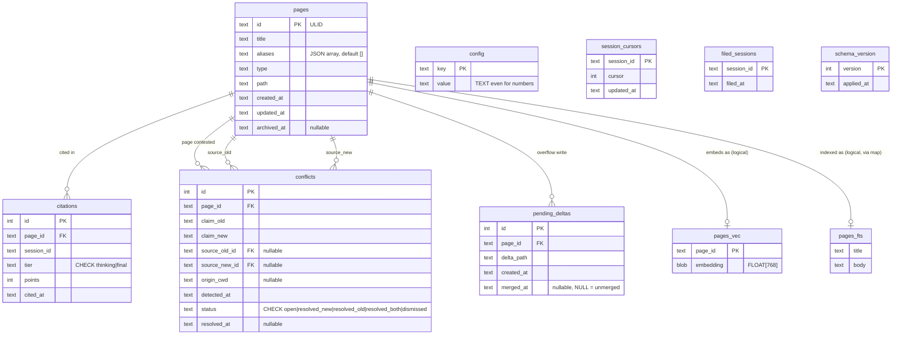
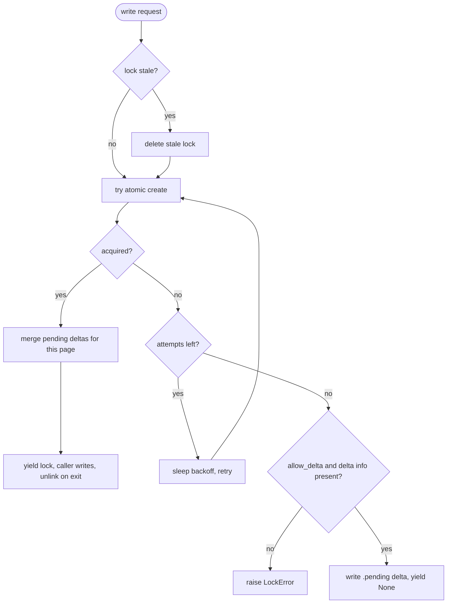
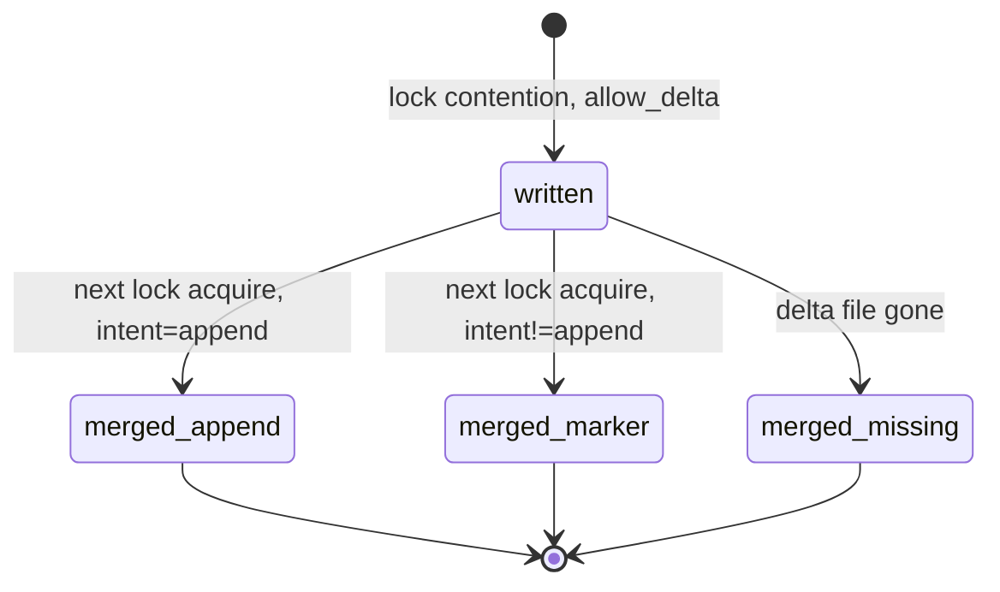

# DATA-MODEL: the SQLite storage layer

> Reference · for maintainers · assumes you've read the [mental model](ONBOARDING.md#1-what-this-is) and know what a page/citation/conflict is.

This is the authoritative description of what lives in `brain.db`, how the
connection is opened, how vectors are stored, and how the file-locking
protocol overflows to `.pending` deltas and merges them back. It describes
what is: the schema, the constants, the file formats. For why these
choices were made, follow the ADR links. For how the engines use them,
see [engines & pipelines](PIPELINES.md).

Every value below is taken from the source. The canonical homes are
`scripts/brain_db.py` (schema, connection, config defaults, `--init`/`--doctor`),
`scripts/embed.py` (embeddings), and `scripts/locks.py` (locking + deltas).

**If you landed here first:** `brain.db` is a plain SQLite file that *indexes* your Markdown vault — it is rebuildable and never the source of truth for content (the `wiki/` files are). Beyond `page/citation/conflict`, a few terms recur below and are defined in full in [ONBOARDING.md § Glossary](ONBOARDING.md#glossary): **ULID** (a page's permanent id — a Universally Unique Lexicographically Sortable Identifier), **hybrid search** (BM25 keyword + dense-vector ranking fused by RRF), **tier-2 citation** (a wikilink in a final answer that the scorer records), and **pending delta** (a write parked in `.pending/` after losing a lock race). Skim the glossary if any of those are new before reading on.

---

## 1. Entity-relationship map

`pages` is the hub. Every content/metadata table references it by
`page_id`. The two virtual tables (`pages_fts`, `pages_vec`) join to `pages`
by convention only. Virtual tables can't carry SQL foreign keys.



> The diagram shows all 10 schema objects (8 real tables + 2 virtual
> tables). `session_id` is a shared namespace across `citations`,
> `session_cursors`, and `filed_sessions`. There is **no `sessions`
> table** and no foreign key among them.

### Declared foreign keys

All declared FKs reference `pages(id)`, and FK enforcement is ON for every
connection (`PRAGMA foreign_keys = ON`):

| Column | References |
|---|---|
| `citations.page_id` | `pages(id)` |
| `conflicts.page_id` | `pages(id)` |
| `conflicts.source_old_id` | `pages(id)` (nullable) |
| `conflicts.source_new_id` | `pages(id)` (nullable) |
| `pending_deltas.page_id` | `pages(id)` |

### Logical (non-FK) joins

- `pages_vec.page_id` matches `pages.id` by convention.
- `pages_fts` rowid matches `pages.id`, mediated by a `pages_fts_map(rowid, page_id)`
  table that is **not defined in `brain_db.py`**. It is created lazily by
  `scripts/ingest.py` / `scripts/search.py`. Do not expect `--doctor` to
  check for it (see §5).

---

## 2. Table reference

### 2.1 `pages`: canonical page registry
Title→ID resolution and the address book for every page. `id` is a
[ULID](ONBOARDING.md#glossary). Filenames may change, the ULID never
does (ADR-01). `aliases` is a JSON array stored as text. `archived_at` is
set on prune and is the flag that excludes a page from search
(`WHERE archived_at IS NULL`). Index: `idx_pages_title ON pages(title)`.

### 2.2 `citations`: the citation scoreboard (ADR-03)
One row per scored citation. `tier` is `CHECK IN ('thinking','final')`.
`points` is copied from config at scoring time. The `thinking` tier is
schema-valid but **inert**: the Stop hook sets `TIER1_ENABLED = False`
(see [why Tier-1 is disabled](DECISIONS.md#tier-1-thinking-block-citation-scoring-is-disabled) and
`wiki/meta/r1-verdict.md`). Index: `idx_citations_page ON citations(page_id)`.
Ranking for prune reads `SUM(points)` per page.

### 2.3 `conflicts`: the conflict queue (freeze-on-ingest)
One row per detected contradiction. While `status = 'open'` the page file
on disk is **untouched**. The new claim lives only in this row (ADR-09).
`origin_cwd` records the project that created the conflict and drives
origin-scoped surfacing (ADR-10). `status` is
`CHECK IN ('open','resolved_new','resolved_old','resolved_both','dismissed')`,
default `'open'`. Partial index: `idx_conflicts_open ON conflicts(status)
WHERE status = 'open'`. State transitions are documented in
[conflict resolution](PIPELINES.md#3-conflicts-scriptsconflictspy).

### 2.4 `pending_deltas`: delta overflow registry
One row per write that lost a lock race. `delta_path` is the posix path of
the `.delta.md` file under `wiki/.pending/`. `merged_at` NULL means the
delta is still waiting. Populated by `locks._write_delta`; drained by
`locks._merge_deltas` on the next successful lock acquire (§7). No index.

### 2.5 `session_cursors`: Stop-hook parse cursor
Byte/line offset into a transcript, per `session_id`, so the async scorer
re-parses only new lines. Default cursor 0. Upserted by `stop_score.py`.

### 2.6 `filed_sessions`: SessionEnd filing idempotency
Presence of a row means that session was already distilled and ingested. This
is the guard that makes the fire-and-forget SessionEnd hook safe to retry.

### 2.7 `config`: key/value config
All values stored as TEXT, even numbers. Seeded once with `INSERT OR IGNORE`
so a re-init never clobbers a tuned value. Full defaults in §3.

### 2.8 `schema_version`: migration bookkeeping
`init_schema` inserts version **1** exactly once. Only v1 exists in code;
there are no migration steps beyond initial creation.

### 2.9 `pages_fts`: FTS5 full-text index
`CREATE VIRTUAL TABLE pages_fts USING fts5(title, body)`. Content-owning
(not `external content`). Rows are keyed to `pages` via `pages_fts_map`
(§1). This is the BM25 half of hybrid search — *hybrid search* runs two
rankers over one query, this keyword half (BM25) and the dense-vector half
below (§2.10), then merges them with Reciprocal Rank Fusion (RRF) by each
hit's rank *position*, not its raw score. (Full definition:
[ONBOARDING.md § Glossary](ONBOARDING.md#glossary).)

### 2.10 `pages_vec`: sqlite-vec vector index
`CREATE VIRTUAL TABLE pages_vec USING vec0(page_id TEXT PRIMARY KEY,
embedding FLOAT[768])`. One 768-dim embedding per page. This is the
dense-cosine half of hybrid search. See [ranking](PIPELINES.md#2-hybrid-search-scriptssearchpy)
for how the two halves fuse.

---

## 3. Config keys and default values

Seeded by `DEFAULT_CONFIG` via `INSERT OR IGNORE`. Existing values are
**never overwritten** on re-init. Every value is stored as TEXT.

| Key | Default | Meaning |
|---|---|---|
| `points_thinking` | `"1"` | citation points, thinking tier (tier disabled) |
| `points_final` | `"5"` | citation points, final-answer tier |
| `prune_pct_low` | `"40"` | prune middle-band lower percentile |
| `prune_pct_high` | `"70"` | prune middle-band upper percentile |
| `prune_min_age_days` | `"30"` | minimum page age to be prunable |
| `inject_relevance_floor` | `"0.015"` | prompt-inject RRF relevance floor |
| `inject_top_n` | `"3"` | number of pointer lines injected |
| `lock_retries` | `"3"` | lock retry count |
| `lock_backoff_seconds` | `"1.6"` | lock backoff base |
| `stale_lock_seconds` | `"600"` | stale-lock cutoff (10 min) |

> [!warning] The three `lock_*` keys are seeded in config but `locks.py`
> does **not** read them. It uses its own module constants
> `DEFAULT_RETRIES = 3`, `DEFAULT_BACKOFF = 1.6`, `STALE_SECONDS = 600`.
> They match numerically but are independent sources of truth. Changing
> the config row will not change locking behaviour. Edit the module
> constants in `scripts/locks.py`.

Which values are read by which engine:

- `points_final` → `stop_score.py` (citation scoring).
- `inject_top_n`, `inject_relevance_floor` → `prompt_inject.py` (passed to
  `hybrid_search`).
- `prune_min_age_days`, `prune_pct_low`, `prune_pct_high` → `prune.py`.
- `points_thinking` → loaded by `stop_score.py` but inert (Tier-1 disabled).

The RRF constant `k=60` and the `0.015` floor are quoted here as
conclusions only. Their derivation and the recalibration warning live in
[ranking](PIPELINES.md#2-hybrid-search-scriptssearchpy) and the named constants `RRF_K` /
signature default in `scripts/search.py`.

---

## 4. Connection: how `connect()` loads sqlite-vec

`connect(db_path)` performs exactly these steps, in order:

1. `sqlite3.connect(db_path)`
2. `PRAGMA foreign_keys = ON`
3. `PRAGMA journal_mode = WAL`
4. `conn.enable_load_extension(True)`
5. `sqlite_vec.load(conn)` loads the sqlite-vec extension
6. `conn.enable_load_extension(False)`

sqlite-vec is therefore loaded on **every** connection, and extension
loading is re-disabled immediately after. This is the reason
[you must never open `brain.db` directly](DECISIONS.md#1-the-hard-invariants-what-never-to-do):
a raw `sqlite3.connect` will not have `vec0` available and any query
touching `pages_vec` fails. Always go through `brain_db.connect()`.

`ensure_ready()` = `connect()` then `init_schema()`. Hooks that only read
call `connect()`; hooks that may write call `ensure_ready()`.

### DB file location

`DB_PATH = os.environ.get("BRAIN_DB", REPO / "brain.db")`, where `REPO` is
derived from `__file__` (two levels up from `scripts/brain_db.py`), i.e.
the vault root.

> [!note] `brain_db.py` does **not** read `$SECOND_BRAIN_VAULT`. Its `REPO`
> comes from the script's own path; the only override is `BRAIN_DB`. The
> hooks locate the vault via `$SECOND_BRAIN_VAULT` and then import
> `brain_db` from `<vault>/scripts`, so the two agree in practice, but the
> module itself is env-var-agnostic. See
> [global install](GLOBAL_INSTALL.md) for how the vault is located.

### `--init`

Calls `ensure_ready()`, prints `initialised <DB_PATH>`, exits 0.
`init_schema` runs all 10 `CREATE ... IF NOT EXISTS` statements in one
transaction, inserts `schema_version = 1` if absent, and seeds any missing
config keys. Idempotent: re-running against a populated DB is a no-op on
existing data. (Running with no flag just prints `<DB_PATH>: pages=<count>`.)

### `--doctor`

Nine checks; prints `ok` / `warn` / `FAIL` per check; returns 1 if any
FAIL, else 0. Use this as the single health command
([where to look when it breaks](ARCHITECTURE.md#6-where-to-look-when-it-breaks)).

| # | Check | Fails on |
|---|---|---|
| 1 | Preflight | `scripts/preflight.sh` nonzero exit (WARN if absent) |
| 2 | Schema/tables | any of the 10 expected tables missing |
| 3 | `PRAGMA integrity_check` | result ≠ `"ok"` |
| 4 | sqlite-vec sanity | `SELECT vec_version()` errors |
| 5 | Ollama ping | GET `localhost:11434/api/version` unreachable → **WARN** only (injection fail-opens) |
| 6 | Stale-lock scan | (WARN) `.*.lock` files under `wiki/` older than 10 min |
| 7 | Orphan deltas | (WARN) `pending_deltas` rows with `merged_at IS NULL` |
| 8 | Scorer-log freshness | (WARN) `.brain/scorer.log` modified <3600 s ago and non-empty |
| 9 | Hook registration | (WARN) neither the global `~/.claude/settings.json` (commands referencing this vault) nor the vault-local `.claude/settings.json` registers the hooks |

Checks 5 to 8 are advisory (WARN). Only 1 to 4 can FAIL the doctor. Check 9 is
WARN-only and **global-install aware**: it first looks in
`~/.claude/settings.json` (honouring `CLAUDE_HOME`) for hook commands whose path
references *this* vault — the normal global-install signal — and reports `ok`
if found; it falls back to the vault-local `.claude/settings.json` for a
project-local install; otherwise it prints an honest note (a template clone
whose active brain is a different vault gets "not registered for THIS vault",
not a bare "no settings.json"). The vault-path match is content-based, never
`readlink`.

("**Fail-open**" here and throughout the docs means: on any error the component prints nothing and returns success rather than raising — so a missing DB, a down embedder, or a bad config degrades the feature to silence instead of breaking the session. It's the reason a down Ollama is a WARN, not a FAIL.)

---

## 5. Embeddings

Owned by `scripts/embed.py`. Callers apply the fail-open policy; `embed.py`
itself always raises on failure.

| Property | Value |
|---|---|
| Endpoint | `OLLAMA_URL`, default `http://localhost:11434` |
| Model | `BRAIN_EMBED_MODEL`, default `nomic-embed-text` |
| Dimensions | `DIM = 768` (matches `pages_vec FLOAT[768]`) |
| Retries | `3`, backoff `0.5 · 2^i` → 0.5 s, 1 s, 2 s; 30 s timeout |
| API | POST `/api/embeddings` with `{"model": MODEL, "prompt": text}` |
| Batch | `embed_batch` loops `embed` per text, no true batching |

Vectors are validated to length 768 (else `EmbedError`) and stored via
`struct.pack("768f", *vec)` → 768 IEEE-754 32-bit floats = **3072 bytes**
per blob, which is what goes into `pages_vec.embedding`. `unpack` reverses
it with `struct.unpack("768f", blob)`.

> [!note] `pack` uses the native `f` format (no explicit `<`/`>`), so byte
> order is platform-dependent. This is fine for a single-user local vault
> but is a portability constraint if a `brain.db` is ever moved between
> architectures.

---

## 6. IDs and ULIDs

Page IDs (`pages.id`) are ULIDs, the stable address of a page (ADR-01).
`brain_db.py` does **not** mint them; `scripts/ingest.py` assigns
`str(ulid.new())` at page construction. `locks.py` also mints a ULID, but
only for delta filenames (§7), never for page IDs. Because IDs are
lexicographically time-sortable and never change, citation and conflict
rows keyed on them survive renames and merges. See
[IDs are addresses](DECISIONS.md#ulids-are-page-addresses-adr-01).

---

## 7. File-locking protocol and `.pending` delta overflow

All writes to `wiki/` go through `locks.lock()`
([never bypass locking](DECISIONS.md#1-the-hard-invariants-what-never-to-do),
ADR-02). This section describes the observable mechanics.

**Lock file.** For `wiki/concepts/foo.md` the lock is a dot-prefixed
sibling `wiki/concepts/.foo.md.lock`, created atomically with
`os.open(..., O_CREAT | O_EXCL | O_WRONLY, 0o644)`. Its contents are a
single line: `"<pid> <iso_timestamp>\n"`.

**Staleness.** A lock is stale if `(now - mtime) > STALE_SECONDS` (600 s)
**or** the recorded PID is not alive. `os.kill(pid, 0)`:
`ProcessLookupError` → dead; `PermissionError` → treated as **alive**
(another user's process); pid ≤ 0 → dead. An unparseable lock file is
treated as stale. Stale locks are deleted before the next create attempt.

**Retry schedule.** `lock()` loops `range(retries + 1)` = 4 total tries by
default. On a failed attempt it sleeps `backoff · 2^attempt · 0.5` →
approximately 0.8 s, 1.6 s, 3.2 s (sum ≈ 5.6 s).

### Acquire / overflow decision



Two things happen only when a lock is acquired: pending deltas for that
page are drained **before** the caller writes (so the caller sees a
merged file), and the lock file is unlinked in a `finally` on exit. If all
retries are exhausted and `allow_delta` is set (with `page_id`,
`delta_body`, and `conn` all supplied), the writer overflows to a delta
and `lock()` yields `None` to signal "wrote a delta instead". Otherwise it
raises `LockError`. Meta-page writers (`hot.md`, `index.md`, `log.md`) use
`allow_delta=False`: they must win the lock or fail.

### Delta file format

`_write_delta` creates `wiki/.pending/` and writes
`<page_id>.<ulid>.delta.md`:

```
---
page_id: <id>
target: <posix path>
intent: <intent>
created: <iso>
---
<body>
```

Then it inserts a `pending_deltas(page_id, delta_path, created_at)` row with
`merged_at` left NULL. `_pending_dir` walks the target's parents for a dir
named `wiki` and returns `wiki/.pending`, falling back to
`<target.parent>/.pending`.

### Delta lifecycle (state view)



On the next successful lock acquire for the page, `_merge_deltas` selects
unmerged rows `ORDER BY created_at` and processes each:

- **file gone** → row marked `merged_at` (avoid spinning), nothing written.
- **`intent == "append"`** → body appended to the target
  (`"\n" + body.rstrip() + "\n"`), row marked `merged_at`.
- **any other intent** → only an HTML marker comment
  `<!-- unmerged intent=... see <file> -->` is appended, then the row is
  still marked `merged_at`.

> [!warning] `replace_section` and `frontmatter_patch` are declared as
> valid intents but are **not implemented**. A non-append delta is
> effectively dropped except for the marker comment, and its row is marked
> merged anyway. This is flagged "TODO: deliberately noisy" in the source.
> In practice ingest only ever writes `intent="append"`, so this path is
> latent, not hit. A maintainer adding a non-append writer must
> implement the merge branch first.

**Sweeping.** `sweep_stale_locks(root)` globs `root.rglob(".*.lock")` and
breaks any stale lock, returning the count. `--doctor` suggests a
`locks.py --sweep`, but no `argparse`/`__main__` CLI exists in `locks.py`.
The function is callable but not wired as a command there.

---

## 8. team.db: the team-brain index

`team.db` is a **separate SQLite file** that indexes teammates' published
pages for hybrid retrieval. It is not part of `brain.db` and never mingles with
it — the isolation is the whole point (see [DECISIONS.md ADR-14](DECISIONS.md#2-adr-log-01-14)).

**Location & override.** `scripts/team_index.py` sets
`TEAM_DB = os.environ.get("BRAIN_TEAM_DB", REPO / "team.db")`. It is opened with
`brain_db.connect(TEAM_DB)` — deliberately reusing the personal connection
helper so `sqlite-vec` loads and WAL/foreign-keys are on, but pointed at a
different file. `brain_db.connect()` with no argument still opens the personal
`brain.db`; only `team_index` passes `TEAM_DB`.

**Schema.** Identical to `brain.db`'s retrieval core (`pages`, `pages_fts`,
`pages_vec`, and the lazily-created `pages_fts_map`), built by the same
`init_schema`, **plus one team-only table**:

```
page_meta(
  page_id  TEXT PRIMARY KEY REFERENCES pages(id),
  owner    TEXT,   -- publisher, from <owner>/ folder or `owner:` frontmatter
  source   TEXT,   -- source_kind of the published page
  rel_path TEXT,   -- path under team-brain-staging/
  mtime    REAL    -- file mtime; drives changed-only reindex
)
```

`page_meta` carries the attribution that a personal page never needs. It is what
lets `team_hybrid_search` return the `owner` tag on every hit
(see [ranking](PIPELINES.md#6-team-brain-retrieval-scriptsteam_indexpy-scriptsteam_searchpy)).

**Population.** `team_index.reindex(changed_only=True)` walks
`team-brain-staging/<owner>/`, and for every page with a ULID `id:` upserts
`pages`/`pages_fts`/`pages_vec`/`page_meta`; it re-embeds only pages whose
`mtime` moved and drops rows whose file disappeared. It runs from
`team_sync.py::_reindex_after_sync()` after a successful pull — embedding cost is
paid on sync, never per query. A reindex failure never fails the sync.

**By design it holds everyone's pages.** Unlike `brain.db` (your notes only),
`team.db` contains every teammate's published pages, keyed by their publisher
ULID. That is what makes a teammate's page rank against your query. Because it is
a distinct file, this never affects your personal ranking, citations, or
conflicts. `team.db` is runtime state (git-ignored, rebuildable from the staging
Markdown), exactly like `brain.db`.

---

## 9. Known gaps (things not in the storage layer's own files)

These are intentionally out of scope for `brain_db.py` / `locks.py` /
`embed.py`. A maintainer grepping for them should look where noted.

- `pages_fts_map`: created by `ingest.py` / `search.py`, not `brain_db.py`.
- ULID assignment for pages: done in `ingest.py`.
- `locks.py --sweep` CLI: function exists, no `__main__` block.
- Non-append delta merge (`replace_section`, `frontmatter_patch`): declared,
  not implemented.
- Migrations beyond `schema_version = 1`: none in code.

---

## Related / Next

- Up: [docs index](README.md)
- Why the schema is shaped this way: [architecture](ARCHITECTURE.md)
- Invariants that guard this layer: [INVARIANTS](DECISIONS.md#1-the-hard-invariants-what-never-to-do)
  (never hand-edit the DB, never bypass locking, IDs are addresses)
- How pages get written / indexed: [engines & pipelines](PIPELINES.md)
- How the two indexes fuse into a ranking: [ranking](PIPELINES.md#2-hybrid-search-scriptssearchpy)
- How conflict rows change state: [conflict resolution](PIPELINES.md#3-conflicts-scriptsconflictspy)
- Term definitions: [glossary](ONBOARDING.md#glossary)
