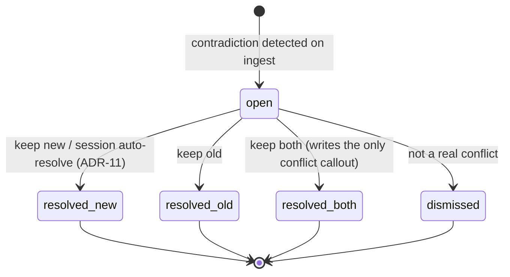
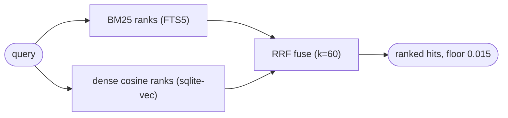

# DECISIONS: invariants and architecture decision log

> Explanation · for maintainers · assumes you have read [ARCHITECTURE.md](ARCHITECTURE.md) or done the tutorial.
> **Nature: Living doc, the canonical ADR record.** This is the maintainer-facing source of truth for the "why" and the "never do this." The invariants in §1 are reproduced verbatim from `CLAUDE.md` (which the agent loads every session). When this file and `CLAUDE.md` disagree on an invariant, `CLAUDE.md` wins for the wording and this file should be corrected.

This document exists to stop a future maintainer from breaking the vault mid-refactor. (The **citation loop** it keeps referring to is the vault's core feedback cycle: you cite a page in an answer → a hook scores that citation → the page ranks higher and resurfaces next time. Kill it and the vault stops learning.) It answers two questions, in order:

1. **Can I touch this?** → the invariants in §1. Break one and you corrupt data, leak private notes, or silently kill the citation loop.
2. **Why is it done this weird way?** → the ADR log in §2, plus the recurring decisions in §3.

---

## 1. The hard invariants: "What NEVER to do"

These are reproduced verbatim from `CLAUDE.md` (the session-time rules the agent loads on every launch). Each carries a one-line rationale naming the failure it prevents, a blast-radius tag, and, where one exists in the code, the enforcement point. A rule without its *because* gets "cleaned up" by the next person who doesn't see the point; that is why the rationale is not optional.

| # | Rule (verbatim) | Why: the failure it prevents | Blast radius |
|---|---|---|---|
| **NEVER-1** | **Never push to `team-staging/`'s remote automatically.** The remote is whatever the user configured at `/hera-setup` (`HERA_TEAM_REMOTE` in `~/.claude/hera.env`) — no fixed remote. Only push after the user has reviewed the diff and explicitly said "push" / "publish" / "approve". _(2026-07-10: the remote became user-configurable at setup; it was previously hard-coded to a single fixed team space repo. The auto-push invariant is unchanged.)_ | Auto-push leaks private, un-reviewed notes to a shared remote. The human diff review is the real safety mechanism (LLM strip is only defense-in-depth). | **CATASTROPHIC** |
| **NEVER-2** | **Never edit `hera.db` by hand outside `scripts/`.** Use `scripts/hera_db.py` or the engines. If you must SQL, do it via `hera_db.connect()` so `sqlite-vec` is loaded. | A raw `sqlite3` connection has no `sqlite-vec` extension loaded, so any query touching `pages_vec` errors; hand edits also skip FK enforcement and WAL. | **CATASTROPHIC** |
| **NEVER-3** | **Never bypass locking.** All writes to `wiki/` go through `locks.lock()`. If a page is locked, the writer overflows to `wiki/.pending/`, which merges on next acquire. Don't work around this. | Concurrent writers corrupt page files; the delta-overflow protocol is the only thing that makes concurrent writes safe. | **CATASTROPHIC** |
| **NEVER-4** | **Never delete from `wiki/.archive/`.** Prune is reversible by design; real deletion is a human decision only. | Prune moves files to `.archive/`; deleting them destroys the only copy and makes `restore` impossible. | **CATASTROPHIC** |
| **NEVER-5** | **Never invoke `claude -p ...` from inside an engine without `CLAUDE_ISOLATION`, and never with `--bare`.** Every subprocess call in `ingest.py` / `publish.py` passes `--setting-sources ""`, `--strict-mcp-config`, `--tools ""`, `--disable-slash-commands` and sets `cwd=CLAUDE_CWD`. | Without isolation, a nested call inherits the Stop hook / `stop_score.py` and CLAUDE.md auto-discovery, firing the vault's own loop recursively. `--bare` used to provide this but skips keychain reads and authenticates only via `ANTHROPIC_API_KEY` or `apiKeyHelper`, so subscription (OAuth) auth fails outright — it is now forbidden. The isolation flags cover the same hook surface `--bare` did, and additionally isolate MCP servers and tools, which `--bare` never did. | **CATASTROPHIC** |
| **NEVER-6** | **Never disable a hook to "quiet things down".** If a hook is misbehaving, fix it or report it, don't silence the loop. | Every hook already fails open and returns 0; silencing it removes citation scoring or session filing entirely, which the ranking loop depends on. | DEGRADES QUALITY |
| **NEVER-7** | **Never modify checks to make them pass.** (This vault was built under the Fable plan-verify-execute protocol; the same rule applies to any later verification work.) | A check edited to pass no longer verifies anything; the invariant it guarded silently dies. | DEGRADES QUALITY |
| **NEVER-8** | **Never bypass `$HERA_VAULT`.** Hooks and skills locate the vault via that env var (written by `install.sh` to `~/.claude/hera.env`). Hard-coding a path breaks global mode and quietly points one machine at the wrong vault. | A hard-coded path works on one machine and silently points another at the wrong vault; global-mode hooks source `hera.env` to find the vault from any CWD. | **CATASTROPHIC** |
| **NEVER-9** | **Never let team content into personal `hera.db`.** Team pages are indexed only in the separate `team.db` (ADR-14). `team_index.py` opens `TEAM_DB`; the personal engines open `hera.db`. Don't merge the stores or point a team writer at `hera.db`. | Mixing team pages into `hera.db` pollutes your local ranking, citations, and conflicts with other people's notes, and breaks the "your notes only" guarantee of the personal store. | DEGRADES QUALITY |

### Enforcement points (where the rule lives in code)

Co-locating the rule with its enforcement lets a maintainer grep from either direction.

| Rule | Enforced by |
|---|---|
| NEVER-1 | `scripts/publish.py`: `commit_and_push()` is a **separate function invoked only by the `push` CLI subcommand**; no `stage`/`diff` path calls it. |
| NEVER-2 | `scripts/hera_db.py`: `connect()` runs `PRAGMA foreign_keys=ON`, `PRAGMA journal_mode=WAL`, and `sqlite_vec.load(conn)` on every connection. |
| NEVER-3 | `scripts/locks.py`: `locks.lock(...)` context manager; every engine (`ingest.py`, `conflicts.py`, `prune.py`) imports it and routes all `wiki/` writes through it. |
| NEVER-4 | `scripts/prune.py`: archives via `shutil.move` to `wiki/.archive/{page_id}.{name}`; `restore` moves back and re-indexes. No engine deletes from `.archive/`. |
| NEVER-5 | `scripts/ingest.py` (3 nested calls) + `scripts/publish.py` (1 call), all `[CLAUDE_BIN, "-p", *CLAUDE_ISOLATION, "--output-format", "text", "--model", CLAUDE_MODEL]` with `cwd=CLAUDE_CWD`. Guarded by `tests/test_nested_claude_isolation.py`. |
| NEVER-8 | All four hooks resolve `REPO` from `$HERA_VAULT` first, falling back to `pathlib.Path(__file__).resolve().parents[2]`; the global install writes the env var via `scripts/install/locator.sh`. |
| NEVER-9 | `scripts/team_index.py`: `TEAM_DB = $HERA_TEAM_DB or REPO/team.db`, opened via `hera_db.connect(TEAM_DB)`; no team writer references the default `hera.db`. `prompt_inject.py` queries `team.db` on a separate connection in its own try/except. |

> **Note on NEVER-2's scope.** `hera_db.py` itself does *not* read `$HERA_VAULT`; its `REPO` is derived from `__file__` and the DB path is overridable only via `HERA_DB`. The `$HERA_VAULT` locator (NEVER-8) governs *hooks and skills*, not `hera_db.py`. Do not conflate the two locators when refactoring.

---

## 2. ADR log (01-14)

One decision per row, stated as the decision (not the problem). The key decisions are expanded below the table (Context / Decision / Consequences). **Reference an ADR from prose by ID only** (e.g. "freeze-on-ingest (ADR-09)"); never paraphrase a decision in two places or the two copies will drift.

| ADR | Title | Decision (one line) | Status |
|---|---|---|---|
| ADR-01 | Page addressing | Dual scheme: opaque immutable **ULID** `id` in frontmatter + human slug filename/wikilink. | Accepted |
| ADR-02 | Concurrent writes | Per-file locking with delta overflow; a lost lock race lands the write in `.pending/` and merges on next acquire. | Accepted |
| ADR-03 | Citation scoring | Async Stop hook parses the transcript; two tiers (thinking = low points, final = high points). | Accepted |
| ADR-04 | Concept matching for injection | Hybrid search: FTS5 (BM25) + sqlite-vec (dense, `nomic-embed-text`) + **RRF** fusion; one DB, one local model. | Accepted |
| ADR-05 | Vault write mechanism | Always direct-to-disk; background processes never depend on the Obsidian GUI. `obsidian-cli` is interactive-only. | Accepted |
| ADR-06 | Interactive-session MCP server | Interactive MCP access is **optional and not required** — the vault is file-based (ADR-05); no MCP server is installed or depended on. | Superseded by ADR-05 |
| ADR-07 | Pruning eligibility | 30-day minimum age; archive the **middle band** of the citation-point spectrum (keep top + bottom). | Accepted |
| ADR-08 | Public/team publish gate | Mandatory human diff review before any team-repo push; private-vault writes are ungated. | Accepted |
| ADR-09 | Conflict pending state | **Freeze-on-ingest**: the page file is untouched while a conflict is `open`; the new claim lives only in a SQLite queue row. | Accepted |
| ADR-10 | Conflict resolution surfacing | Origin-scoped, deferred-interactive; **four channels**; relevance-triggered (channel 3) is deliberately unscoped. | Accepted |
| ADR-11 | Session work vs. external sources | Explicit session statements auto-win (auto-resolve as `resolved_new`); implications and external contradictions queue. | Accepted |
| ADR-13 | Team space staging hygiene | Owner folder is named from `HERA_OWNER` (default `randy`), never the git author name; the staging clone ships a committed `.gitignore` so `git add -A` can't sweep OS junk into a publish. | Accepted |
| ADR-14 | Team space retrieval | Team pages get the **same hybrid retrieval as local** (BM25 + dense + RRF), indexed by publisher ULID in a **separate `team.db`** (never `hera.db`), refreshed on sync and fused owner-tagged into injection. | Accepted |

> **Terms used across this log.** *Hybrid search* = two rankers over one query — BM25 (keyword match over the FTS5 index) and dense-vector cosine (semantic) — merged with *Reciprocal Rank Fusion (RRF)*, which combines by each hit's rank *position*, not its raw score, so the two incomparable scales fuse cleanly. *ULID* = a page's permanent id (see [ONBOARDING.md § Glossary](ONBOARDING.md#glossary)). "ADR" throughout is an **Architecture Decision Record**.

> **A twelfth decision existed in the original design: ADR-12 (query-mode budgets).** It governs a `/hera-query` skill that is **not** among the installed skills, so it is out of scope here and omitted from the table above. If query mode is ever built, add it back as ADR-12.

### The ADRs a maintainer bumps into most, expanded

#### ADR-09: Freeze-on-ingest

When ingest detects a contradiction against a page that already exists at the target path, it does **not** write the new page and does **not** upsert or index it. Instead the existing page id is added to a `frozen` set, a `conflicts` row is enqueued (status `open`), and ingest `continue`s past the write. The page on disk stays pristine; the new claim exists only as the `claim_new` column in the queue row. Contested warnings are applied at *injection* time (`prompt_inject.py` checks the conflict table), never by editing the page.

Consequence for a maintainer: **queries always retrieve the old claim** until someone resolves the conflict. `_page_id_should_index` re-checks the `frozen` set by path and returns `False`, so frozen pages are excluded from the DB upsert and search index. If you refactor the write loop in `ingest.py`, preserve the `continue`-before-write behavior. That is the freeze.



While a conflict is `open`, the page file is frozen: the diagram's entry edge is the *only* moment the file's fate is decided. `resolve_new` appends `## Update` + `## Superseded` sections to the page; `resolve_old` and `dismiss` touch no file; `resolve_both` writes the single permanent `> [!conflict]` callout. Nothing is ever destroyed. States map 1:1 to the `conflicts.status` CHECK constraint (`open`, `resolved_new`, `resolved_old`, `resolved_both`, `dismissed`).

#### ADR-10: Four surfacing channels

Conflicts record the `origin_cwd` of the session that created them. Resolution surfaces through four channels:

1. **Interactive ingest**: immediate, user present → resolve inline.
2. **SessionStart**: deferred-interactive, origin-scoped. `session_start.py` injects full claim text for conflicts matching the current `cwd` (or with `origin_cwd IS NULL`); conflicts from *other* projects surface only as a quiet count line.
3. **Relevance-triggered per-turn injection**: deliberately **unscoped**. `prompt_inject.py` appends a `⚠ contested` warning naming the existing and new claims (`existing: … · new: … · unresolved.`) to any retrieved contested page, regardless of origin, because relevance to the current prompt is what matters.
4. **`/hera-conflicts`**: on-demand, global queue via `conflicts.py list`.

If you add a fifth surface, keep channel 3 unscoped and the others origin-scoped. That asymmetry is the decision.

#### ADR-11: Session auto-resolve

Lives in `ingest.py` (not `conflicts.py`). When `source_kind == "session"` **and** `_user_stated_explicitly(raw, claim_new)` confirms the user stated the new fact directly in their own voice, the conflict is enqueued and then **immediately** `conflicts.resolve_new(conn, cid)` is called, so the page is *not* frozen and the new claim wins with the same `## Superseded` treatment as a manual `resolve_new`. Assistant-authored text does not count as an explicit statement. Everything else (implications, external-source contradictions) stays `open`.

#### ADR-06: Interactive-session MCP server (Superseded)

Originally this ADR planned to add MCPVault (`@bitbonsai/mcpvault`) as a file-based MCP server for editing vault pages from within an interactive session. It was **never implemented** — the setup step stayed a `# CP-3` TODO and no engine or hook ever called an MCP tool. In practice a *different* server (`mcp-obsidian`, backed by the Obsidian Local REST API plugin) was configured by hand in `~/.claude.json`, but it too was standalone: nothing in the pipeline depended on it, and it was removed (2026-07-12).

The decision is superseded by **ADR-05**: all vault access is **direct-to-disk**, and Obsidian is only a front end for reading/hand-editing the Markdown. An interactive MCP server is **optional** — a convenience for editing notes from a chat, never a requirement. The vault ingests, searches, scores, resolves conflicts, prunes, and syncs the team space with Obsidian closed or absent. Setup no longer installs any MCP server or Obsidian editing skills.

#### ADR-13: Team space staging hygiene

The `team-staging/` clone is a **separate git repo** from the vault (it tracks whatever `HERA_TEAM_REMOTE` points at, not this vault's own remote). Two consequences bit us and are now closed:

- **Owner identity.** `publish.py` and `team_remove.py` both resolve the owner from `HERA_OWNER` (default `randy`) and confine every write and every `git rm` to `team-staging/<owner>/`. `/hera-setup` originally created the owner folder from the git author name, which on a machine whose git identity differs from `HERA_OWNER` produced an **orphan folder** (named after the git author, e.g. `<git-author>/.gitkeep`) that no writer ever touched and owner-scoped removal could never clean. Setup now uses `${HERA_OWNER:-randy}` — one identity, shared by every path.
- **OS junk.** The engines render the review diff with `git add -A` inside the clone (`publish.py`, `team_remove.py`). Because the clone has no ignore rules of its own, a Finder `.DS_Store` at the staging root gets staged and swept into the next publish. `team_sync.py clone-or-pull` now drops a committed `.gitignore` into the clone so `.DS_Store` and editor junk are ignored at the source.

Both artifacts are owner-review-committed out of the live remote, not force-pushed — history is the undo (consistent with ADR-08's human-gated push).

#### ADR-14: Team space hybrid retrieval

Team pages were originally found by a keyword/word-count disk scan — a different, weaker retrieval path than local recall. The decision: give the team space the **same substrate as the personal vault** (BM25 via FTS5 + dense `sqlite-vec` + RRF, `k=60`), so a teammate's page ranks against a query exactly as your own pages do, keyed by the publisher's ULID.

The retrieval is identical; the **store is deliberately separate**. `scripts/team_index.py` indexes `team-staging/<owner>/` into a distinct `team.db` (opened with `hera_db.connect(TEAM_DB)`, `TEAM_DB = $HERA_TEAM_DB` or `<repo>/team.db`), with the same schema as `hera.db` plus a team-only `page_meta(page_id, owner, source, rel_path, mtime)` for attribution. `search.team_hybrid_search` runs the shared `_rrf_fuse` over that connection; `team_search.py` and `prompt_inject.py` fuse the owner-tagged team hits with local `hybrid_search` on the same score scale.

Two properties fall out and must be preserved:

- **Isolation.** No team page, ULID row, or citation ever enters your personal `hera.db`. `team.db` is a separate file; `team_index.py` opens *only* `TEAM_DB`, and the per-turn team query is a separate connection in its own try/except. This is why `team.db` can hold *every* publisher's pages without polluting your local ranking, citations, or conflicts. It is the same class of invariant as NEVER-2 (don't cross the stores).
- **Cost on sync, not per query.** `team_sync.py::_reindex_after_sync()` re-embeds only changed pages (`reindex(changed_only=True)`) after a successful pull; a reindex failure (e.g. Ollama down) warns and never fails the sync, and the team query is fail-open at injection time. `team.db` is rebuildable runtime state, git-ignored like `hera.db`.

See [DATA-MODEL.md § team.db](DATA-MODEL.md#8-teamdb-the-team space-index) and [PIPELINES.md § team retrieval](PIPELINES.md#6-team space-retrieval-scriptsteam_indexpy-scriptsteam_searchpy).

#### RRF k=60 (ADR-04): the ranking constants

Ranking fuses two rank lists, BM25 over `pages_fts` and dense cosine over `pages_vec`, with Reciprocal Rank Fusion.



The **shape** is above; the **values** live in code and belong in prose, not a node:

- `score(item) = Σ 1/(RRF_K + rank_i)`, summed over each substrate that ranked the page, with `RRF_K = 60` (module constant `RRF_K` in `scripts/search.py`). Ranks are 1-based positional, **not** the raw `bm25()`/distance values.
- The relevance floor is **`0.015`** (`hybrid_search(..., floor=0.015)`, also seeded as `config.inject_relevance_floor`). RRF scores span about 0.0 to 0.03 for two sources at k=60, so `0.015` keeps hits ranked highly by at least one substrate. **Recalibrate the ranking before changing either constant.**

> Stale-doc note carried from the audit: the `search.py` module docstring header says `floor=0.15`; the signature default and body agree on `0.015`. **`0.015` is authoritative.**

#### ULIDs are page addresses (ADR-01)

`pages.id` is a ULID, minted at ingest (`str(ulid.new())`). Filenames come from `_slugify(title)` and may change; the ULID does not. Every SQLite row keys on the ULID (`citations.page_id`, `conflicts.page_id`, `pending_deltas.page_id` are FKs to `pages.id`), so scoreboard and conflict rows survive renames and merges. Citations the LLM writes use slugs; `_resolve_title` maps title/alias → ULID at scoring time.

#### Tier-1 (thinking-block) citation scoring is DISABLED

Only final-answer wikilinks (Tier 2) are counted. `stop_score.py` carries `TIER1_ENABLED = False`. Per `wiki/meta/r1-verdict.md`, Claude Code 2.1.201 does not persist thinking-block content parseably in the transcript JSONL, so a Tier-1 scan would silently score nothing. The thinking-scan code and `points_thinking` config are present but inert; the schema still permits `tier IN ('thinking','final')`. Flip the flag to `True` only when a release starts persisting parseable thinking blocks.

---

## 3. When to write a new ADR

Write one only when the decision is **significant × costly-to-reverse × non-obvious**. All three:

- **Significant**: it affects structure, dependencies, interfaces, the data model, or a cross-cutting invariant.
- **Non-obvious**: a reasonable engineer would have picked a real alternative (e.g. ADR-11's session auto-resolve, or disabling Tier-1 scoring).
- **Costly to reverse**: undoing it later means data migration or touching many call sites.
- **Someone will ask "why is it done this weird way?"**: if yes, an ADR pre-empts the re-litigation.

Do **not** write an ADR for reversible, local, or obvious choices. ADR inflation kills the practice.

**Lifecycle rules:**

- ADRs are **immutable once Accepted.** You never edit a decision, you **supersede** it. Write ADR-13, set its `Status: Accepted`, flip the old ADR to `Superseded by ADR-13`, and cross-link both directions. This preserves the history of thinking, which is the point.
- **Status is the freshness signal.** A reader must tell live from historical at a glance.
- **One decision per record, numbered, never renumbered.** Numbers are addresses, mirroring the ULID philosophy.
- **One source of truth.** ADR bodies live in this file; `CLAUDE.md`'s "Design decisions you'll bump into" section is a digest that points back here. If you add an ADR, add it here first, then update `CLAUDE.md`.

Minimal format (Nygard-style, keep it short or people stop writing them):

```
# ADR-NN: <short imperative title: the decision>
Status: Proposed | Accepted | Superseded by ADR-MM | Deprecated
Date: YYYY-MM-DD   (the decision date, never updated)

## Context      : the forces and the real bind
## Decision     : "We will …"
## Consequences : what gets easier AND what gets harder (don't omit the harder)
## Alternatives considered  : what you rejected and why
```

---

## Related / Next

- **How to modify safely, "where to look when it breaks":** [ARCHITECTURE.md §6](ARCHITECTURE.md#6-where-to-look-when-it-breaks)
- **System shape and boundaries:** [ARCHITECTURE.md](ARCHITECTURE.md)
- **Data shapes the invariants protect:** [DATA-MODEL.md](DATA-MODEL.md)
- **Session-time rules the agent loads:** [`../CLAUDE.md`](../CLAUDE.md)
- **Why Tier-1 scoring is off (dated reference):** [`../wiki/meta/r1-verdict.md`](../wiki/meta/r1-verdict.md)
- Up: [docs index](README.md)
