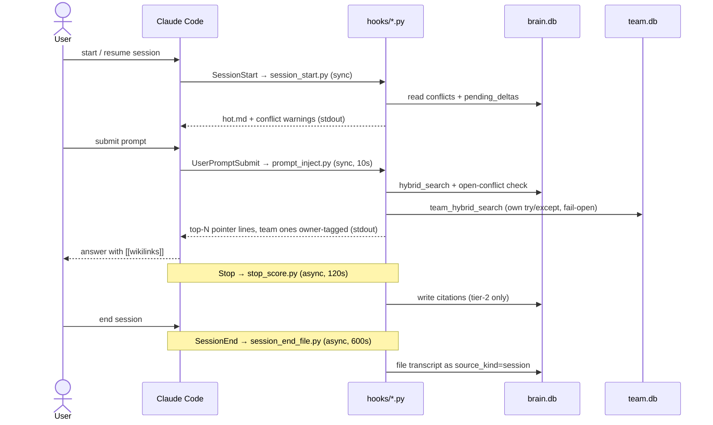
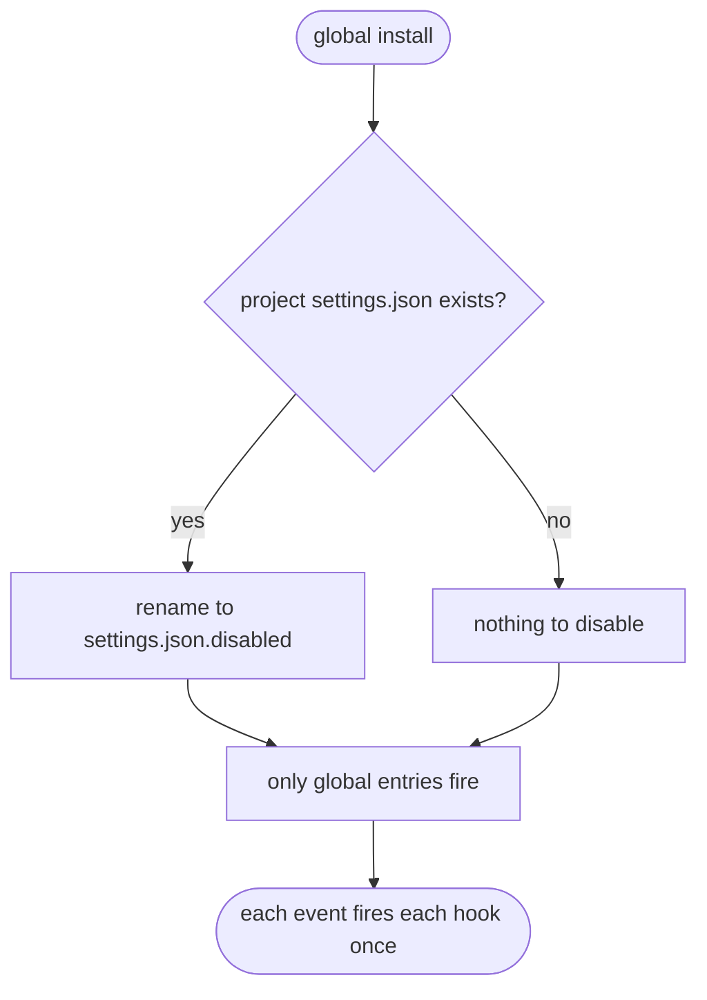

# HOOKS: the four Claude Code hooks

> Reference · for maintainers · assumes you know what the Second Brain is (see [ARCHITECTURE.md](ARCHITECTURE.md)) and have read [CLAUDE.md](../CLAUDE.md).

**In one paragraph:** Claude Code lets you register scripts that fire on session events. This vault registers four of them — one when a session starts, one on every prompt you submit, one when the assistant finishes a turn, one when the session ends — and they are the *only* code that runs without you asking. Together they are the automatic half of the vault: they surface relevant notes into your context, score which notes you actually cite, and file each session back into the vault. This doc is the reference for exactly what each one does and how it is wired; read it when you need to change hook behavior or debug why a hook did (or didn't) fire.

This is the authoritative reference for the four hooks that connect Claude Code
to the vault engines. It describes what each hook is (event, timing,
sync/async nature, stdin inputs, outputs, fail-open posture) and the exact
command lines that register them. It does not teach you how to install them
(see [GLOBAL_INSTALL.md](GLOBAL_INSTALL.md)) or argue why the design is what
it is (see [DECISIONS.md](DECISIONS.md)).

The hooks live at `.claude/hooks/*.py`. All four are registered in
`.claude/settings.json` (project-local) or merged into `~/.claude/settings.json`
(global install).

---

## 1. When each hook fires

Two of the four hooks run synchronously in the turn's critical path and must be
fast. The other two are async and fire side-effect work that can never block
the session.



| Claude Code event | Hook script | Sync/async | Timeout | Writes `brain.db`? |
|---|---|---|---|---|
| `SessionStart` | `session_start.py` | sync | none set | no (read-only) |
| `UserPromptSubmit` | `prompt_inject.py` | sync | 10 s | no (read-only) |
| `Stop` | `stop_score.py` | **async** | 120 s | yes |
| `SessionEnd` | `session_end_file.py` | **async** | 600 s | yes |

The two sync hooks are read-only against the DB and emit text to stdout that
Claude Code injects into the session. The two async hooks emit nothing to
Claude Code. They only produce side effects (DB rows, files, logs) and are
designed so that failure is invisible and harmless.

---

## 2. Vault resolution (identical in all four hooks)

Every hook resolves the vault root the same way, verbatim:

```python
_env_vault = os.environ.get("SECOND_BRAIN_VAULT")
REPO = pathlib.Path(_env_vault).resolve() if _env_vault else pathlib.Path(__file__).resolve().parents[2]
```

- **Primary:** `$SECOND_BRAIN_VAULT` (set by the global install via
  `~/.claude/second-brain.env`), resolved to an absolute path.
- **Fallback:** `pathlib.Path(__file__).resolve().parents[2]`, from
  `.claude/hooks/<file>.py`, up three levels to the vault root. This is the
  project-local path where the env var is absent.

All four then push `str(REPO / "scripts")` onto `sys.path` before importing
`brain_db`, `search`, or `ingest`. The sync hooks call `brain_db.connect()`;
the async hooks call `brain_db.ensure_ready()`.

> Never hard-code a vault path. Doing so breaks global mode and can silently
> point a machine at the wrong vault. See [CLAUDE.md](../CLAUDE.md) "What NEVER
> to do" #8.

---

## 2a. The `SECOND_BRAIN_OFF` kill switch (identical in all four hooks)

Setting `SECOND_BRAIN_OFF` in a session's environment disables the entire
automatic loop for that session — no context injection, no citation scoring,
no session filing, no session-start output. Launch a dark session with:

```
SECOND_BRAIN_OFF=1 claude
```

Each hook's `main()` begins with the same guard, checked **before** its
`try` block so it returns with zero side effects (no DB touch, no subprocess
fork, no log line):

```python
def _brain_off() -> bool:
    v = os.environ.get("SECOND_BRAIN_OFF", "").strip().lower()
    return v not in ("", "0", "false", "no", "off")


def main() -> int:
    if _brain_off():
        return 0
    ...
```

- **ON** (loop disabled): `1`, `true`, `yes`, `on` (any case) — or any other
  non-empty value.
- **OFF** (loop runs normally): unset, empty, or `0` / `false` / `no` / `off`.

This is a deliberate, user-driven opt-out, distinct from the fail-open silence
each hook already has (§4–§7): fail-open swallows *errors*; this switch is an
*intentional* off. It is a runtime env var, so it is not written to
`~/.claude/second-brain.env` and needs no reinstall — scope it to one session,
or `export` it in a shell where you never want the brain active. It is the
sanctioned way to quiet the loop; do not disable a hook by editing
`settings.json` (see [CLAUDE.md](../CLAUDE.md) "What NEVER to do" #6).

---

## 3. Registered command lines and the locator

The hooks are registered in two forms. The command string is the only
difference between them; the event→script→async→timeout mapping is identical.

**Project-local** (`.claude/settings.json`, 859 bytes), no env sourcing,
relies on the `parents[2]` fallback for vault location:

```
.venv/bin/python "$CLAUDE_PROJECT_DIR/.claude/hooks/<hook>.py"
```

**Global** (`scripts/install/settings_fragment.json`, 1059 bytes), sources the
locator first so `$SECOND_BRAIN_VAULT` is exported before the vault's `.venv`
python runs the symlinked hook under `~/.claude/hooks/`:

```
. "$HOME/.claude/second-brain.env" && "$SECOND_BRAIN_VAULT/.venv/bin/python" "$HOME/.claude/hooks/<hook>.py"
```

The leading `.` **dot-sources** `~/.claude/second-brain.env`, which contains a
single `export SECOND_BRAIN_VAULT="<abs>"` line (plus two comment lines). This
runs before the venv python, so the exported var is present in the hook's
environment. Because the command begins by sourcing the locator, the hook works
from any (foreign) working directory. The locator file is written by
`install.sh` via `scripts/install/locator.sh`. See
[GLOBAL_INSTALL.md](GLOBAL_INSTALL.md) for the install topology.

---

## 4. `session_start.py`: SessionStart

- **Event:** `SessionStart` (fires on `startup | resume | clear | compact`).
  **Sync.** No timeout configured.
- **Input (stdin):** reads event JSON from `sys.stdin.read()`. Tolerant:
  empty/invalid JSON becomes `{}`. Reads `evt.get("cwd")`, falling back to
  `os.getcwd()`.
- **Output (stdout):** the assembled sections, joined by `\n` with a trailing
  newline. Claude Code injects this at session start.
- **Behavior, three sections:**
  1. **hot cache:** the full contents of `wiki/hot.md` (rstripped). If missing,
     emits a literal `# Recent Context` placeholder noting that the vault is
     empty and no hot cache exists yet.
  2. **origin-scoped open conflicts:** via `brain_db.connect()`, queries
     `conflicts JOIN pages` where
     `status='open' AND (origin_cwd = <cwd> OR origin_cwd IS NULL)`. Emits a
     header "## Open conflicts from this project (please raise with the user
     immediately)", then per conflict the `[[title]]`, `existing:` and `new:`
     claims, and a pointer to `/brain-conflicts`. Separately counts conflicts
     **elsewhere** (`origin_cwd IS NOT NULL AND origin_cwd != <cwd>`) and emits a
     one-line count. This is the origin-scoped surfacing channel. See
     [DECISIONS.md](DECISIONS.md) (ADR-10).
  3. **stale pending deltas:** counts `pending_deltas WHERE merged_at IS NULL AND
     created_at < <now-86400s>` (24h cutoff). If nonzero, emits a "## Stale
     pending deltas" note.
- **Fail-open:** the DB block is wrapped in `try/except Exception: pass` ("DB
  might not exist yet on first launch, silent skip"), and so is the whole
  `main()`. **Always returns 0.** A broken hook prints nothing and never blocks
  session start.

---

## 5. `prompt_inject.py`: UserPromptSubmit

- **Event:** `UserPromptSubmit`. **Sync, timeout 10 s.**
- **Input (stdin):** parses JSON and extracts the prompt from `evt["prompt"]` →
  `evt["user_prompt"]` → `evt["text"]` (first non-empty). If stdin is not JSON,
  treats the raw text as the prompt (test tolerance).
- **Output (stdout):** a pointer block, or nothing.
- **Behavior:**
  - Early silent exit if `BRAIN_INJECT_NO_OLLAMA == "1"` (test override
    simulating Ollama down).
  - Silent if the prompt is empty or `len < 4`.
  - Silent if the prompt matches `CODING_RE`, a heuristic that skips pure
    coding/syntax questions (e.g. "how do i … git/npm/docker…", "write a
    function/regex…", "fix/debug this…").
  - Otherwise: `brain_db.connect()`, reads `inject_top_n` and
    `inject_relevance_floor` from the `config` table, then calls
    `search.hybrid_search(conn, prompt, top_n=..., floor=...)`. No hits → silent.
  - **Injects** a block headed "Relevant vault pages (pointers only, read the
    file if needed):", one bullet per hit in the form
    `- [[Title]]  (abspath)` followed by the first content line, where `abspath`
    is the **absolute** path under `$SECOND_BRAIN_VAULT` (`REPO / h.path`), not
    the bare vault-relative `h.path`. Hooks run from any cwd under the global
    install; a relative path can't be resolved from a non-vault cwd, and an
    agent that fails to open it wrongly concludes the index is stale. The
    one-liner comes from `_first_line_from` (skips frontmatter and
    heading/callout lines, truncated to 160 chars). The block is deliberately
    phrased as factual statements, not imperatives, to sidestep prompt-injection
    defenses.
  - **Inline conflict warnings:** for retrieved pages with an open conflict,
    appends a `⚠ contested` line naming `existing: <claim_old>`,
    `new: <claim_new>`, and `unresolved.` under the relevant hit. This is the unscoped, relevance-triggered
    surfacing channel. See [DECISIONS.md](DECISIONS.md) (ADR-10).
  - **Team-brain fusion:** after the local `hybrid_search`, the hook also runs
    `search.team_hybrid_search` over the separate `team.db` in **its own**
    `try/except`, then merges those owner-tagged team hits with the local hits by
    the same RRF score (one scale) before taking `top_n`. Team pointers are
    tagged ` (team: <owner>)`. Team pages are indexed only in `team.db` and never
    enter `brain.db` (isolation invariant — [ADR-14](DECISIONS.md#2-adr-log-01-14) / rule #9 in [CLAUDE.md](../CLAUDE.md) "What NEVER to do"); the nested
    try/except means a missing `team.db` or a down embedder degrades to
    local-only and never breaks injection. See [RETRIEVAL.md § local ↔ team](RETRIEVAL.md#4-how-data-flows-local-team)
    and [DATA-MODEL.md § team.db](DATA-MODEL.md#8-teamdb-the-team-brain-index).
- **Fail-open:** the entire body is wrapped in `try/except Exception: pass`.
  **Always returns 0.** Any failure (Ollama down, DB missing, config rows absent)
  prints nothing. This is the make-or-break invariant: injection must degrade to
  silence, never to an error that disrupts the prompt.

For the ranking used here (RRF over BM25 + dense, `k=60`, floor `0.015`), see
[DECISIONS.md](DECISIONS.md).

---

## 6. `stop_score.py`: Stop (citation scorer)

- **Event:** `Stop`. **Async (`async: true`), timeout 120 s.**
- **Input (stdin):** event JSON. Uses `evt["transcript_path"]` (fallback env
  `BRAIN_TRANSCRIPT`) and `evt["session_id"]` (fallback env `BRAIN_SESSION_ID`,
  else `"unknown"`).
- **Output:** no stdout for Claude. Side effects: inserts `citations` rows in
  `brain.db`; appends a line to the scorer log at `$BRAIN_SCORER_LOG` or
  `REPO/.brain/scorer.log`.
- **What it scans for (tier 2, "final", the only active tier):** two regexes
  over the assistant's final-message text:
  - `SOURCE_RE` matches canonical `(Source: [[Title]])`.
  - `WIKILINK_RE` matches bare `[[Title]]` (and `[[Title|alias]]`, capturing the
    title before `|`).
  - The titles from both are unioned.
- **How citations are recorded:** a per-`session_id` cursor from
  `session_cursors` (default 0) marks where scanning resumes. Only
  `type == "assistant"` entries are scored; only `type == "text"` content blocks
  are concatenated (tool_use/tool_result ignored). Each title resolves via
  `_resolve_title` (exact `pages.title COLLATE NOCASE`, else a case-insensitive
  scan of `pages.aliases`). It inserts
  `INSERT INTO citations(page_id, session_id, tier, points, cited_at)
  VALUES (?,?,'final',?,?)` with `points_final` from config. **Dedup:** a `seen`
  set keyed `(line_num, page_id, tier)` means a page cited N times in one turn
  scores at most once per tier per turn. The cursor is then upserted to
  `last_line+1` and committed.
- **Tier-1 (thinking-block) scoring is DISABLED** via `TIER1_ENABLED = False`.
  The thinking-block scan and `points_thinking` config load exist but are inert.
  The reason: Claude Code does not persist thinking-block content parseably in
  the transcript, so Tier-1 would silently score nothing. Flip the flag to `True`
  only when a release starts persisting parseable thinking blocks. Full rationale:
  [DECISIONS.md](DECISIONS.md) and `wiki/meta/r1-verdict.md`.
- **Fail-open:** `main()` wraps everything in `try/except`; on error it writes
  `"scorer error:\n" + traceback` to the log but **returns 0** and never raises.
  A missing/nonexistent `transcript_path` logs and returns 0. Uses
  `brain_db.ensure_ready()`.

> [!important]
> Your final-answer wikilinks become scored citations that shift the vault's
> ranking. Cite what you actually used; do not sprinkle `[[wikilinks]]`
> decoratively.

---

## 7. `session_end_file.py`: SessionEnd (session filing)

- **Event:** `SessionEnd`. **Async (`async: true`), timeout 600 s.**
- **Input (stdin):** event JSON → `transcript_path` (fallback `BRAIN_TRANSCRIPT`)
  and `session_id` (fallback `BRAIN_SESSION_ID`, else `"unknown"`). Also supports
  a **CLI mode** `session_end_file.py <transcript> <session_id>`, which is how the
  forked worker re-enters.
- **Output:** no stdout for Claude. Side effects: writes `.brain/session-<id>.md`,
  ingests it, and appends to the filing log at `$BRAIN_FILING_LOG` or
  `REPO/.brain/filing.log`.
- **Async dispatch:** if `BRAIN_FILING_SYNC == "1"` it runs inline (for tests).
  Otherwise it is **fire-and-forget**: `subprocess.Popen([...python, __file__,
  transcript_path, session_id], stdout/stderr=DEVNULL, start_new_session=True)`
  detaches a background worker and the hook returns immediately.
- **What it distills:** builds a plain-text doc (header + walked transcript,
  extracting `role` + text per message; string content as `[role] <content>`,
  list content collecting only `type == "text"` blocks, tool_use noise dropped),
  writes it to `REPO/.brain/session-<id>.md`, then calls
  `ingest.ingest_source(..., source_kind="session")`.
- **Idempotency (`filed_sessions` table):** `_already_filed` checks
  `SELECT filed_at FROM filed_sessions WHERE session_id = ?`; if a row exists,
  filing logs "already filed, skipping" and returns 0 *before* distilling.
  After a successful ingest, `_mark_filed` does
  `INSERT OR REPLACE INTO filed_sessions(session_id, filed_at) VALUES (?, ?)`.
  Safe to retry, per `session_id`.
- **Fail-open:** `main()` wraps in `try/except`; errors log
  `"hook error:\n"+traceback` and **return 0**. Inside `run_filing`, missing
  transcript, flatten exception, or ingest exception each log and return 1, but
  those non-zero returns are only surfaced in sync/CLI mode. The async hook never
  blocks the session. Uses `brain_db.ensure_ready()`.

Session-source ingest is where explicit user statements auto-resolve contradictions
as `resolved_new`. See [DECISIONS.md](DECISIONS.md) (ADR-11).

---

## 8. The double-firing hazard `install.sh` prevents

Claude Code merges user-level (`~/.claude/settings.json`) and project-local
(`.claude/settings.json`) hooks. If **both** are registered, every event fires
its hook twice. The concrete failures:

- **Stop:** two `stop_score.py` runs → double citations, inflating `points_final`.
- **SessionEnd:** two racing filing jobs on the same `session_id`, idempotent via
  `filed_sessions`, but wasteful.
- **UserPromptSubmit:** inject content emitted twice per prompt.

To prevent this, install step 7 renames the project file
`.claude/settings.json` → `.claude/settings.json.disabled` (and uninstall
restores it). During global install, hooks run only from the merged
`~/.claude/settings.json` entries.



The merge itself is deduped by command signature, so re-running install is a
no-op on an already-installed machine. See
[GLOBAL_INSTALL.md](GLOBAL_INSTALL.md) for the merge and disable/restore logic.

---

## Related / Next

- **Up:** [docs index](README.md) · [CLAUDE.md](../CLAUDE.md) (session-time rules)
- **Install topology & the locator:** [GLOBAL_INSTALL.md](GLOBAL_INSTALL.md)
- **Why tier-1 is off, RRF `k=60`, freeze-on-ingest, ADRs:** [DECISIONS.md](DECISIONS.md)
- **Schema the hooks read/write (`citations`, `conflicts`, `pending_deltas`, `session_cursors`, `filed_sessions`):** [DATA-MODEL.md](DATA-MODEL.md)
