# Second Brain in 5 minutes

> Tutorial + mental model · for new users and evaluators · no prerequisites beyond a terminal.
> Finish this page and you'll understand what the system is, what it does on its own, and how to reach your first result. For how it works underneath, see [ARCHITECTURE.md](ARCHITECTURE.md).

---

## 1. What this is

Second Brain is a **single-user note vault that runs inside Claude Code**. You feed it things you read (a URL, a file, an image) and it turns them into cross-linked Markdown pages. Later, when you ask Claude a question, the pages it retrieves get quietly surfaced into the conversation, and the pages you actually *cite* in your answers rank higher next time. It fixes a common problem: notes and past sessions normally rot into an unsearchable pile. This keeps the useful ones findable and self-ranking.

Three properties shape everything below, so state them up front:

- **You don't run the tool. You talk to Claude, and hooks fire on their own.** The unit of interaction is a conversation turn, not a shell command.
- **It's local-first and single-user.** Nothing leaves your machine unless you explicitly say "push" to the team brain.
- **Some behavior is automatic** (four hooks). Section 4 discloses every one of them before you hit it.

---

## 2. The core loop (one diagram)

The defining property is a **feedback loop**: what you cite changes what surfaces next time. Read this diagram top-to-bottom.

```mermaid
flowchart TD
  A([source: URL / file / image]) --> B[ingest: extract pages + assign ULIDs]
  B --> C[(brain.db + wiki/ pages)]
  C -->|you ask a question| D[recall: hybrid search injects pointers]
  D --> E[you answer, citing &#91;&#91;pages&#93;&#93;]
  E -->|Stop hook, async| F[score: tier-2 citations recorded]
  F --> C
  G([session ends]) -->|SessionEnd hook, async| H[file: distill transcript into a page]
  H --> B
```



In one sentence: ingest builds pages, recall surfaces them, citing them scores them, and every session files itself back in as a new source. The vault gets better at surfacing what matters the more you use it.

---

## 3. One concrete trace

You paste an article URL and say "ingest this." Ingest extracts a **source** page plus a handful of **concept** and **entity** pages, gives each a permanent **ULID**, and writes them to `wiki/` (refreshing the search index). A week later you ask Claude a design question. The prompt-inject hook runs a hybrid search and slips in a few pointer lines like `- [[Retrieval-Augmented Generation]] (path): one-line summary`. You read one, use it, and write `(Source: [[Retrieval-Augmented Generation]])` in your answer. When your turn ends, the scorer records that citation, worth 5 points, so that page ranks higher next time. When the session ends, the whole transcript is distilled into its own page and ingested as a `source_kind=session` source. The loop closes.

---

## 4. What happens automatically vs. what you type

This is the trust-critical section. Two lists, then the disclosure table.

**Happens automatically (the four hooks):**
- Session-start summary (emits recent context + conflict warnings)
- Prompt-time context injection (surfaces relevant pages as pointers)
- Citation scoring after your turn (records which pages you cited)
- Session filing at session end (distills the transcript into a page)

**Only when you ask (skills you invoke):**
- Ingest a source (`/brain-ingest`)
- Prune the vault (`/brain-prune`)
- Resolve conflicts (`/brain-conflicts`)
- Team-brain ops (`/brain-team add|remove|retrieve`) — publish your redacted
  pages up, un-publish your own (owner-scoped, human-gated delete), or search
  the team brain by owner alongside your vault.

> [!important]
> The one surprising side effect of *normal use*: your final-answer wikilinks become scored citations that shift the vault's ranking. Cite pages that were actually useful. Don't sprinkle `[[links]]` decoratively.

### The four hooks, disclosed

Each hook is framed as "acts on your behalf," with its fail-safe posture and where to watch it work. All four return success in every path, so **no hook can hard-fail or block your session.**

| Hook | Fires when | What it does (for you) | Touches | Fail-safe | How to see it worked |
|---|---|---|---|---|---|
| `session_start.py` | Session starts | Shows you recent context from `hot.md`; warns about open conflicts from this project and stale pending deltas | Reads `brain.db`, `wiki/hot.md` | Fail-open: if the DB isn't there yet, prints nothing | The context block at the top of a new session |
| `prompt_inject.py` | You submit a prompt | Surfaces relevant vault pages as pointer lines so you don't have to remember them | Reads `brain.db` | Fail-open (10 s timeout): any error, whether Ollama is down or the vault is empty, injects nothing and you never notice | The "Relevant vault pages" block under your prompt |
| `stop_score.py` | You finish a turn | Records which pages you cited so useful ones surface first | Writes `citations` in `brain.db` | Async, never blocks; errors go to the log and it still returns cleanly | `.brain/scorer.log`; new rows in `citations` |
| `session_end_file.py` | Session ends | Distills the transcript into a page and ingests it, so past sessions become searchable | Writes `.brain/session-<id>.md`, ingests it | Async, fire-and-forget, **idempotent** (safe to retry via `filed_sessions`) | `.brain/filing.log`; a new `.brain/session-<id>.md` |

**Where to watch:** the two async hooks log to `.brain/scorer.log` (scoring) and `.brain/filing.log` (filing). The two sync hooks don't log; you see their output directly in the conversation. If a filed session looks wrong, it's reversible: re-filing is idempotent, and prune moves pages to `wiki/.archive/` rather than deleting them.

---

## 5. Quickstart: to your first result in ~5 minutes

> **What success looks like:** you ask a question and the tool surfaces a relevant page it retrieved, *or* you ingest one thing and see pages appear. That's the "aha." Everything before it is setup.

This is one golden path. Other setups (global multi-project install) live in [GLOBAL_INSTALL.md](GLOBAL_INSTALL.md).

### Prerequisites (checklist)

Each has a verify-command and the expected output. A prereq you can't verify will fail silently later.

| Check | Command | Expected |
|---|---|---|
| Ollama installed | `ollama --version` | prints a version |
| Ollama daemon up | `curl -s http://localhost:11434/api/version` | JSON with a version (not a connection error) |
| Embedding model pulled | `ollama pull nomic-embed-text` | "success" (the first pull downloads the model and may take a few minutes) |
| Claude Code CLI | `claude --version` | prints a version |
| Python 3.8+ | `python3 --version` | 3.8 or higher |

### Step 1: Install

The setup skill bootstraps the Python `.venv`, creates `brain.db`, scaffolds `wiki/`, verifies Ollama, and wires the hooks. In Claude Code, from the vault, type:

```
/brain-setup
```

✓ Success: setup reports the venv built, `brain.db` created, and Ollama reachable.
✗ If instead you see an Ollama error, see the failures table below.

### Step 2: Confirm it's healthy

```
"$SECOND_BRAIN_VAULT/.venv/bin/python" "$SECOND_BRAIN_VAULT/scripts/brain_db.py" --doctor
```

✓ Success: the doctor prints its checks with `ok`/`warn`, and exits without any `FAIL`. (An Ollama `warn` is tolerable, since injection just fails open, but for the first-result aha you want it reachable.)
✗ If instead you see `FAIL` on schema/tables, re-run `/brain-setup`.

### Step 3: Your first ingest (the aha)

Ingest is driven by *talking to Claude*. Type, literally:

```
ingest https://en.wikipedia.org/wiki/Retrieval-augmented_generation
```

Claude runs the ingest engine and reports back with the pages it created and the source wikilink it cites.

✓ Success: you see new pages appear under `wiki/`, a source page plus a few concept/entity pages, and Claude names them.
✗ If instead nothing appears, check the failures table (usually Ollama not running, so embeddings can't be built).

### Step 4: Recall it

Start a fresh prompt and ask something the article covers, e.g.:

```
What problem does retrieval-augmented generation solve?
```

✓ Success: under your prompt you see a block headed **"Relevant vault pages (pointers only…)"** listing `[[Retrieval-Augmented Generation]]` with its path and a one-line summary. That's the loop working.

### What just happened

You closed the first half of the [core loop](#2-the-core-loop-one-diagram): a source became pages (ingest), and a later question surfaced them (recall). If you now cite one of those pages in an answer, the scorer will rank it higher. That's the feedback that makes the vault self-organizing.

### Common first-run failures

| Symptom | Cause | Fix |
|---|---|---|
| Ingest produces nothing; injection empty | Ollama daemon not running | `ollama serve` (or start the app), then retry |
| `--doctor` warns "ollama unreachable" | Same as above | Start Ollama; the doctor pings `http://localhost:11434/api/version` |
| Ingest errors on embeddings | `nomic-embed-text` not pulled | `ollama pull nomic-embed-text` |
| Skill/hook commands say vault not found | `$SECOND_BRAIN_VAULT` unset | Global install writes it to `~/.claude/second-brain.env`; project-local mode falls back to the vault path automatically |
| A new prompt injects nothing at all | Empty vault (no pages yet) or prompt looks like a pure coding question (heuristically skipped) | Ingest something first; ask a conceptual question |
| Hooks never fire | Hooks not registered — for a global install they live in `~/.claude/settings.json`; for a project-local install, in the vault's `.claude/settings.json` | `--doctor` check 9 verifies hook registration in both modes (global first); if it warns "not registered for THIS vault", run `install.py` from the vault or re-run `/brain-setup` |

### Next steps

If you saw pages appear and then surface, the loop works. Go to [ARCHITECTURE.md](ARCHITECTURE.md) for the deep dive: how ingest, hybrid search, ranking, conflicts, and the four hooks fit together.

---

## Glossary

Ordered in the sequence a newcomer meets each term. One line each; defined here once.

- **vault**: the Markdown notes directory (`wiki/`) plus its `brain.db` index. We call it the *vault* throughout.
- **page**: one Markdown note: a *source*, *concept*, or *entity*. What you'd call a "note."
- **ULID**: a page's permanent address, stored in its frontmatter. Filenames may change; the ULID never does, so citation and conflict records never break.
- **ingest**: turning a source (URL/file/image) into pages: extract, assign ULIDs, write through locks, refresh the index.
- **hot.md**: the recent-context cache the session-start hook shows you at the top of a new session.
- **RRF (Reciprocal Rank Fusion)**: how recall ranks results. It fuses a BM25 keyword list and a dense-vector list into one score by each hit's *rank position* (`k=60`), not its raw score. The same math also fuses your local hits with team hits at query time, on one scale (see [RETRIEVAL.md § the ranking model](RETRIEVAL.md#1-the-ranking-model-read-this-first)).
- **hybrid search**: the retrieval step recall runs — BM25 keyword search and dense-vector search over the same pages, combined with RRF. `search.hybrid_search` runs it over your `brain.db`; `search.team_hybrid_search` runs the same substrate over `team.db`.
- **fusion**: merging two ranked lists into one order by RRF score. Two places do it: BM25 + dense *within* one store, and your local hits + owner-tagged team hits *across* the two stores (same scale, so a teammate's page and yours compete fairly).
- **team.db**: a second SQLite index, **local and git-ignored just like `brain.db`**, that indexes teammates' published pages pulled into `team-brain-staging/`. It never merges with `brain.db` (the isolation invariant); the two are only fused at query time. The one genuinely off-machine store is the team git *remote*, not `team.db`.
- **tier-2 citation**: a `[[wikilink]]` or `(Source: [[Title]])` in your *final answer*; the scorer records it as a citation (worth `points_final` = 5). Tier-1 (thinking-block) scoring exists in code but is disabled.
- **conflict / freeze-on-ingest**: when an ingest would contradict an existing page, the new version is **not** written; the page on disk stays untouched and the contradiction is queued as an open conflict for you to resolve with `/brain-conflicts`.
- **pending delta**: a write that lost a lock race. It's parked in `wiki/.pending/` as a `.delta.md` file and merged back (appended) on the next successful lock acquire. (Ingest writes use append intent, so the golden path re-applies cleanly.)

---

## Related / Next

- **Deep dive:** [ARCHITECTURE.md](ARCHITECTURE.md), the system's shape, engines, and the four-hook pipeline.
- **Multi-project install:** [GLOBAL_INSTALL.md](GLOBAL_INSTALL.md), the symlink-based global deployment — including the optional global CLAUDE.md block that keeps citation-learning and safety rules active in every directory (`install.sh --with-global-claudemd`, or answer yes when asked).
- **Session-time rules:** the vault's `CLAUDE.md`, what the agent will and won't do.
