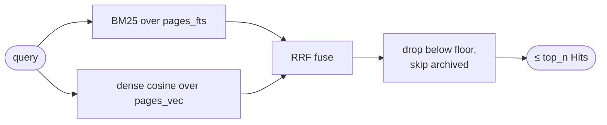
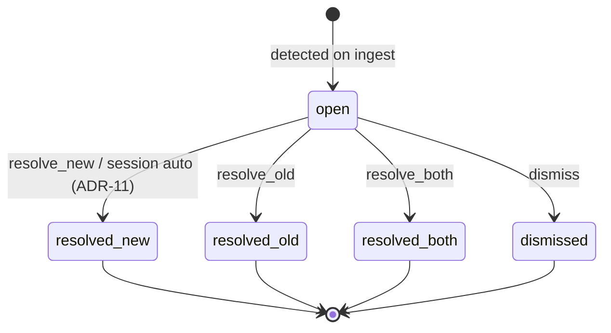

# PIPELINES: the engine scripts, and how not to break them

> Reference + Explanation · for maintainers · assumes you've read [CLAUDE.md](../CLAUDE.md) and the [mental model](ONBOARDING.md#1-what-this-is).
> Nature: **Living doc.** Source of truth for how the five core engines behave.
> For the storage layer they write to, see [DATA-MODEL.md](DATA-MODEL.md). For the hooks that call them, see [HOOKS.md](HOOKS.md).

**In one paragraph:** the vault does five kinds of work — turn a source into pages (*ingest*), find relevant pages for a query (*hybrid search*), record disagreements between an old page and a new claim (*conflicts*), archive stale pages (*prune*), and redact-then-stage pages for a team repo (*publish*). Each is one Python file under `scripts/`. This doc walks each engine's logic in order; the hooks and skills that trigger them are thin wrappers documented elsewhere. Read a section when you need to change or debug that engine.

The five core engines under `scripts/` are the vault's machinery. Every write to `wiki/`, every citation score, every conflict, and every archived page passes through one of them. The hooks and skills are thin dispatchers; these files hold the logic. (The team space layer — `publish.py` for the push side plus `team_sync.py`, `team_search.py`, `team_index.py`, and `team_remove.py` for the pull/index/remove side — is documented with the `/hera-team` skill. It never writes to your personal `wiki/` or `hera.db`; its only index is a **separate `team.db`** that `team_index.py` owns, so team content and personal content stay isolated. See [team retrieval](#6-team space-retrieval-scriptsteam_indexpy-scriptsteam_searchpy) below and [DATA-MODEL.md § team.db](DATA-MODEL.md#8-teamdb-the-team space-index).)

| Engine | Source | Job |
|---|---|---|
| Ingest | `scripts/ingest.py` | Turn one source into source/concept/entity pages; detect contradictions; index |
| Hybrid search | `scripts/search.py` | BM25 + dense retrieval fused with RRF |
| Conflicts | `scripts/conflicts.py` | Resolve queued contradictions into one of four outcomes |
| Prune | `scripts/prune.py` | Rank by citation points; archive the middle band; restore |
| Publish | `scripts/publish.py` | Strip private notes, stage a public copy, gate the push |

Two invariants hold across all five core engines and are load-bearing. Do not break them:

- **All `wiki/` writes go through `locks.lock(...)`** (ingest, conflicts, and prune all import `locks`). See [DATA-MODEL.md § locking](DATA-MODEL.md#7-file-locking-protocol-and-pending-delta-overflow).
- **All nested LLM calls are isolated.** 3 calls in `ingest.py`, 1 in `publish.py`, identical command shape `[CLAUDE_BIN, "-p", *CLAUDE_ISOLATION, "--output-format", "text", "--model", CLAUDE_MODEL]` run with `cwd=CLAUDE_CWD`. `CLAUDE_ISOLATION` is `--setting-sources ""` (load no settings files, so no hook from any source fires), `--strict-mcp-config`, `--tools ""`, and `--disable-slash-commands`. That is what prevents the vault's own Stop hook from firing recursively inside an engine. `--bare` is **not** used: it skips keychain reads, so subscription auth fails.

Model and binary are env-overridable everywhere: `CLAUDE_BIN` (default `claude`), `HERA_CLAUDE_MODEL` (default `sonnet`).

---

## 1. Ingest: `scripts/ingest.py`

**Entry point:** `ingest_source(source_path, source_kind="file", raw_dir=None, conn=None) -> Result`. The `Result` dataclass carries the source `PageWrite`, the concept and entity pages, warnings, and a log entry.

### The pipeline

```mermaid
flowchart TD
  A(["source file"]) --> B["read + preserve raw copy"]
  B --> C["LLM extract &#40;isolated&#41;"]
  C --> D["build PageWrites + assign ULIDs"]
  D --> E["write source page &#40;locked&#41;"]
  D --> F{"page already<br>exists at path?"}
  F -->|no| I["write page &#40;locked&#41;"]
  F -->|yes| G["detect contradiction &#40;isolated&#41;"]
  G -->|no_contradiction / elaboration| I
  G -->|contradiction| H{"session source +<br>user stated it explicitly?"}
  H -->|"yes &#40;ADR-11&#41;"| J["enqueue conflict + resolve_new"]
  H -->|no| K["freeze: enqueue conflict,<br>skip write + index"]
  J --> I
  I --> L["upsert pages + FTS + vector"]
  L --> M["update hot.md / index.md / log.md &#40;locked&#41;"]
  M --> N(["indexed"])
  K --> M
```



Step by step:

1. **Read + preserve raw.** The source is resolved and read (missing file becomes `SystemExit`). The raw text is copied into `raw_dir` (default `wiki/.raw/articles/`) via `shutil.copy2`, unless the source already lives there.
2. **Ensure DB.** If no connection was passed, `hera_db.ensure_ready()` opens one, which loads sqlite-vec and initializes the schema (see [DATA-MODEL.md](DATA-MODEL.md#4-connection-how-connect-loads-sqlite-vec)).
3. **LLM extraction.** `_call_claude_extract` runs `claude -p` (isolated) with the extraction prompt on stdin, `timeout=600`, over the first 200,000 characters of the raw text. It demands ONE JSON object: a `source` block plus 1 to 8 `concepts` and 0 to 8 `entities`, each with a TitleCase human title (these become filenames and wikilink targets) and a frontmatter-free markdown body. Stray code fences are stripped; on a JSON parse failure it attempts to recover the first `{...}` block.
4. **Build PageWrites + assign ULIDs.** Each new page gets `id=str(ulid.new())` at construction: source, every concept, every entity. **The ULID is the page's permanent address; the filename is a slug of the title and may change.** Bodies are decorated with callouts: `> [!source]` for the source page (plus `## Key takeaways` / `## Summary`), `> [!info]` for concepts, `> [!info] ({kind})` for entities.
5. **Write the source page** through `locks.lock(...)`, with source-specific frontmatter (`source_url`, `source_kind`, `ingested`, `raw_path`).
6. **Per concept/entity: contradiction check, then conditional write** (see below).
7. **Upsert + index** every non-frozen page into `pages`, `pages_fts`, and `pages_vec`, then commit.
8. **Update meta pages** (`hot.md`, `index.md`, `log.md`) each through its own lock. `log.md` is prepended (entry inserted after the `# Log` header); `index.md` is appended.

### Contradiction detection and freeze-on-ingest

A contradiction check only runs for a page whose target path **already exists** (`_existing_page_at`, which reads the current body from disk as the source of truth). `_detect_contradiction` runs `claude -p` (isolated) (`timeout=300`) over the first 8,000 characters of each of the old and new bodies. The verdict is one of `contradiction`, `no_contradiction`, or `elaboration`, plus `claim_old`, `claim_new`, `reason`. The prompt is deliberately conservative, because false positives flood the conflict queue.

**Freeze-on-ingest (ADR-09):** when the verdict is `contradiction`, ingest does **not** write the page file and does **not** upsert or index it. Instead it adds the existing page's ULID to a `frozen` set, enqueues a `conflicts` row (status defaults to `open`), records a warning, and moves on. The existing page on disk is left untouched, and the new, contradicting version never lands. `_page_id_should_index` re-checks by path and returns `False` for any page whose ULID is in `frozen`, so frozen pages are excluded from the DB upsert and index step. The contested claim lives **only** in the SQLite queue row until a human resolves it.

**Session auto-resolve (ADR-11):** if `source_kind == "session"` **and** `_user_stated_explicitly(raw, claim_new)` returns `True`, the conflict is still enqueued, but then `conflicts.resolve_new(conn, cid)` is called immediately. The new claim wins, with the `## Superseded` treatment, and the page is **not** added to `frozen`. `_user_stated_explicitly` uses an LLM prompt that checks the user stated the fact directly, in their own voice; assistant-authored text does not count. Everything that is not an explicit session statement (mere implications, external-source contradictions) waits as an open conflict.

> [!important]
> Freeze means the page file is genuinely pristine while a conflict is open. Contested warnings are applied *at retrieval time* (see [§2](#2-hybrid-search-scriptssearchpy) and [HOOKS.md](HOOKS.md)) by checking the conflict table, never by editing the page. If you change this, the "old claim is still what queries return, plus a warning" guarantee breaks.

---

## 2. Hybrid search: `scripts/search.py`

**Contract:** `hybrid_search(conn, query, top_n=3, floor=0.015, fetch=20) -> list[Hit]`, where `Hit = (page_id, title, path, score, fts_rank, vec_rank)`.

Two retrievers run over the same query, each producing a ranked list; the lists are fused with Reciprocal Rank Fusion. The diagram shows the **shape**; the exact numbers are in the prose below it, because a node can't hold the arithmetic legibly.



**BM25 half (`_fts_hits`).** The query is tokenized with `re.findall(r"\w+", query)`; tokens shorter than 2 characters are dropped; each survivor is quoted as a phrase and OR-joined (`"a" OR "b"`), so it is a bag-of-words match on ANY term. It runs `bm25(pages_fts)` joined through `pages_fts_map` (rowid to page_id), ordered ascending, so **lower `bm25()` is better**. Any `sqlite3.OperationalError` returns `[]` (fail-safe); an empty token list returns `[]`.

**Dense half (`_vec_hits`).** The query is embedded via `embed(query)` (Ollama `nomic-embed-text`, 768-dim, see [DATA-MODEL.md § embeddings](DATA-MODEL.md#5-embeddings)) and packed, then `SELECT page_id, distance FROM pages_vec WHERE embedding MATCH ? ORDER BY distance`, a sqlite-vec KNN where **lower distance is nearer**.

**RRF fusion.** Ranks are **1-based positional** (position in each ordered list), not derived from the raw `bm25()` or `distance` values. For each page:

```
score = Σ  1 / (RRF_K + rank_i)      over each retriever that ranked it
RRF_K = 60
```

A page ranked by both retrievers gets both terms added; a page ranked by only one gets a single term. Results are sorted by score descending.

**Ties.** `_rrf_fuse` sorts by score alone (`key=lambda x: -x[1]`) with no secondary key, so two pages with an identical fused score keep their stable input order (FTS hits are added before dense hits). This differs from the cross-store merge in `prompt_inject.py`, which sorts by `(-score, title)` — there, an exact tie is broken alphabetically by title. If you depend on a reproducible top-N ordering, note this asymmetry: within a single store the tie order is incidental; across the local+team merge it is deterministic by title.

**The floor is `0.015`** (the signature default). After sorting, only the top `top_n` are considered, and any hit with `score < 0.015` is skipped. The rationale: with two sources at `k=60`, RRF scores span roughly `0.0` to `0.03`, so `0.015` keeps hits ranked highly by at least one substrate and drops the weakly-fused tail.

Finally, each surviving page is looked up with `... WHERE id = ? AND archived_at IS NULL`, so **archived or missing pages are skipped** and pruned pages never resurface in retrieval. At most `top_n` (default 3) hits return.

> [!note]
> The module docstring header says `floor=0.15`; that line is stale. The signature default and the docstring body both say `0.015`, and the code value `0.015` is authoritative. Fix the header if you touch this file; do not "fix" the code to match the stale comment.

Both `RRF_K = 60` and the floor are calibrated against the two-retriever, `k=60` score distribution. Recalibrate the ranking before changing either.

---

## 3. Conflicts: `scripts/conflicts.py`

A conflict is a queued contradiction (see [§1](#contradiction-detection-and-freeze-on-ingest)). It sits in the `conflicts` table with `status='open'` until resolved into one of four terminal states. Resolution never destroys anything.



The four outcomes:

| Outcome | Function | What it writes |
|---|---|---|
| **resolved_new** | `resolve_new` | New claim wins. Appends `## Update ({date})` with the new claim + source wikilink, then `## Superseded` recording the old claim as believed-until-date, contradicted-by-source. Locked write (`allow_delta=False`), then marks the row `resolved_new`. Nothing destroyed. |
| **resolved_old** | `resolve_old` | Old claim wins. Marks the row `resolved_old` only, **no page edit**. |
| **resolved_both** | `resolve_both` | Both legitimate in different contexts. Appends a permanent `> [!conflict] Two claims, both legitimate in different contexts` callout listing both claims + source. This is the **only** place a `> [!conflict]` callout is ever written; it is never a pending-state artifact. Then marks `resolved_both`. |
| **dismissed** | `dismiss` | Not a real conflict. Marks the row `dismissed` only. |

`list_open` returns open conflicts ordered by `detected_at`. CLI subcommands: `list`, `new`, `old`, `both`, `dismiss` (each takes a conflict id `cid`).

**Session auto-resolve routes through the same primitive.** The ADR-11 auto-resolve logic lives in `ingest.py`, not here, but it calls `conflicts.resolve_new(conn, cid)`, so a session's explicit-statement contradiction gets the identical `## Superseded` treatment as a manual "keep new". There is one code path for "new claim wins," reached two ways.

> [!note]
> The `/hera-conflicts` skill documents the CLI as `conflicts.py new|old|both|dismiss <cid>`, while [CLAUDE.md](../CLAUDE.md) shows `conflicts.py resolve <id> new|old|both`. The subcommand form in the source is `new|old|both|dismiss`. This is a known doc drift; the source is authoritative.

---

## 4. Prune: `scripts/prune.py`

Prune ranks pages by how often they've been cited, archives the middle band, and can restore any of them. It is reversible by design: files move to `wiki/.archive/`, nothing is deleted.

### Ranking and eligibility

The ranking metric is **total citation points**: `COALESCE(SUM(c.points), 0)` via a `LEFT JOIN citations c ON c.page_id = p.id`, grouped by page, sorted `pts ASC, created_at ASC`. So the least-cited, oldest pages sort first.

Eligibility (`eligible`) requires all of:

- `type IN ('concept','entity','question')`, so **sources, domain, and meta pages are never prunable**;
- `archived_at IS NULL`, not already archived;
- `created_at <= cutoff`, where `cutoff = now - prune_min_age_days * 86400`, a **minimum age 30 days** (`config.prune_min_age_days`, default 30).

### The middle band

`middle_band` selects the grey middle of the citation-point spectrum, keeping the extremes: the top (active working context) and the bottom (rare-but-important pages you'd regret losing).

- Percentile defaults: `prune_pct_low = 40`, `prune_pct_high = 70` (both config-overridable).
- If fewer than 3 candidates exist, returns `[]` (nothing to prune).
- Otherwise `lo = round(n * low / 100)`, `hi = round(n * high / 100)`, clamped, returning `cands[lo:hi]`. Because the list is sorted ascending by points, this slice is the 40th to 70th percentile band by default.

### Archive and restore

```mermaid
flowchart LR
  A["eligible + middle band"] --> B["candidates &#40;dry-run&#41;"]
  B --> C{"apply --yes?"}
  C -->|no| B
  C -->|yes| D["move to wiki/.archive/<br>&#40;locked&#41;"]
  D --> E["delete vec + fts + fts_map rows,<br>set archived_at"]
  E --> F["restore <page_id>"]
  F --> G["move file back,<br>archived_at = NULL"]
  G --> H["re-index FTS + vector"]
```



**Apply (`prune`):** each file moves via `shutil.move` through `locks.lock(..., allow_delta=False)` to `wiki/.archive/{page_id}.{original_name}`. Then the page's `pages_vec`, `pages_fts`, and `pages_fts_map` rows are deleted, `pages.archived_at` is set, and the change is committed. A `## [date] prune` block is prepended to `wiki/log.md` (unless dry-run). The dry-run form (`candidates`) prints intended actions and changes nothing.

**Restore (`restore <page_id>`):** finds a page with `archived_at IS NOT NULL`, moves the archive file back to its original path, sets `archived_at = NULL`, then explicitly rebuilds the search index by calling `ingest._index_page_search` on a reconstructed `PageWrite` (the type is hard-coded `"concept"`). The file move alone does not restore FTS/vector rows; `restore` re-indexes them.

CLI: `candidates [--json]`, `apply [--yes]` (interactive `y/N` confirm unless `--yes`), `restore <page_id>`.

> [!important]
> Nothing is ever deleted from `wiki/.archive/` by this engine. Real deletion is out of scope and is a human decision only. See [CLAUDE.md § What NEVER to do #4](../CLAUDE.md).

---

## 5. Publish: `scripts/publish.py`

Publish is the only path notes take out of the private vault. It runs private ingest, LLM-strips public-safe copies into a staging repo, renders a diff for human review, and **only pushes on an explicit, separate operator command**.

```mermaid
flowchart TD
  A(["source"]) --> B["private ingest &#40;ingest_source&#41;"]
  B --> C["per page: strip body &#40;isolated&#41;"]
  C --> D{"redactor output?"}
  D -->|SKIP| E["drop page"]
  D -->|redacted body| F["stage under<br>team-staging/&lt;owner&gt;/"]
  F --> G["render_diff &#40;git add -A + git diff --cached&#41;"]
  G --> H{"human reviews + says push?"}
  H -->|no| I["staging left as-is"]
  H -->|"yes &#40;push subcommand&#41;"| J["commit_and_push"]
```



**Strip (`_strip_body`).** Runs `claude -p` (isolated) (`timeout=600`) with a redactor prompt that REMOVES personal info, named private individuals, and subjective claims/opinions, and KEEPS facts, patterns, framework definitions, well-known public entities, and wikilinks. If the redactor returns the token `SKIP`, the page is dropped (`None`). Code fences are stripped from output.

**Stage (`stage_private_ingest`).** First runs the real private ingest (`ingest.ingest_source`). Then for every produced page it reads the private body, strips frontmatter, strips the body, and writes to `team-staging/<OWNER>/{sources|concepts|entities}/{slug}.md` with `visibility: public` frontmatter added. `OWNER` = env `HERA_OWNER` (default `randy`). Frozen pages (no file on disk because a contradiction froze them) are recorded as skipped `"frozen (contradiction pending)"`; `SKIP`-ped pages as `"redactor said SKIP"`. Returns `{staged[], skipped[], warnings[]}`.

**The human push-gate (ADR-08), never auto-push.** Staging is a separate git repo. `render_diff` does `git add -A` + `git diff --cached --no-color` and returns the diff string for human review; it stages nothing to the remote. `commit_and_push(commit_msg)` (`git add -A`, then `git commit`, then `git push`) is a **separate function invoked only by the `push` CLI subcommand**. There is no code path where `stage` or `diff` calls `commit_and_push`. Pushing requires an explicit `push` invocation by the operator.

> [!important]
> The strip is defense in depth; **the human diff review is the actual safety mechanism.** Never wire `stage`/`diff` to `push`, and never push automatically. The remote is fixed, see [CLAUDE.md § What NEVER to do #1](../CLAUDE.md). On rejection, staging is left as-is (no `git reset`).

---

## 6. Team space retrieval: `scripts/team_index.py` + `scripts/team_search.py`

Retrieval over the team space uses the **same substrate as local recall** — BM25 (FTS5) + dense (`sqlite-vec`) fused with RRF — so a teammate's published page ranks against your query the same way your own pages do. The difference is *where* it's indexed: team pages live in a **separate `team.db`**, never in your personal `hera.db`.

```mermaid
flowchart TD
  A(["team-staging/&lt;owner&gt;/*.md"]) -->|team_sync clone/pull| B["_reindex_after_sync"]
  B --> C["team_index.reindex&#40;changed_only&#41;"]
  C --> D[("team.db<br>pages + fts + vec + page_meta")]
  Q(["query"]) --> E["team_hybrid_search&#40;team.db&#41;"]
  D --> E
  E -->|owner-tagged hits| F["fused with local hybrid_search"]
```



**Index (`team_index.py`).** Opens `team.db` via `hera_db.connect(TEAM_DB)` — reusing the connection helper (so `sqlite-vec` and WAL load) but pointing it at a different file (`TEAM_DB = $HERA_TEAM_DB` or `<repo>/team.db`). It walks `team-staging/<owner>/`, and for every page carrying a ULID `id:` upserts `pages`/`pages_fts`/`pages_vec` plus a team-only `page_meta(page_id, owner, source, rel_path, mtime)` row. `reindex(changed_only=True)` re-embeds only pages whose mtime moved and drops pages whose file disappeared. Embedding cost is paid **on sync**, not per query.

**Refresh on sync.** `team_sync.py` calls `_reindex_after_sync()` after a successful `clone`/`ff-pull`. A reindex failure (e.g. Ollama down) **never** fails the sync — it warns and moves on; `team_index` is imported lazily so sync still works without the index engine.

**Search (`team_search.py`).** `search.team_hybrid_search(team_conn, query, owner=None)` runs the same `_rrf_fuse` BM25+dense fusion over `team.db`, joining `page_meta` to attach `owner`/`source`, and returns dicts (team hits carry `owner`, which the local `Hit` does not). `team_search.py` merges that with the local `hybrid_search` by fused RRF score (same scale) and tags each hit's owner. `--owner NAME` restricts to that teammate and excludes your personal vault. The per-turn hook (`prompt_inject.py`) does the same fusion and tags team pointers ` (team: <owner>)`; the team query sits in its own try/except so a missing `team.db` or a down embedder contributes nothing and never breaks injection (fail-open).

**Isolation invariant.** `team_index.py` opens only `TEAM_DB`; no team page, ULID row, or citation ever enters your personal `hera.db`. That separation is what lets team retrieval surface *everyone's* published pages without polluting your local ranking. See [DATA-MODEL.md § team.db](DATA-MODEL.md#8-teamdb-the-team space-index) and [DECISIONS.md ADR-14](DECISIONS.md#2-adr-log-01-14).

---

## Config and thresholds: where the numbers live

Do not restate these values inline elsewhere; link here. Config defaults are seeded via `INSERT OR IGNORE` and never overwrite existing values.

| Value | Where it lives | Constraint |
|---|---|---|
| RRF k | `RRF_K` in `scripts/search.py` | `= 60`; recalibrate ranking before changing |
| Relevance floor | `hybrid_search(floor=...)` in `scripts/search.py`; seeded as `inject_relevance_floor` in `config` | `= 0.015`; recalibrate before changing |
| Inject top-N | `config.inject_top_n` | default `3` |
| Prune min age | `config.prune_min_age_days` | default `30` days |
| Prune band | `config.prune_pct_low` / `prune_pct_high` | defaults `40` / `70` |
| Citation points (final) | `config.points_final` | default `5` |
| Citation points (thinking) | `config.points_thinking` | default `1`; tier is disabled, see [HOOKS.md](HOOKS.md) |
| Claude binary / model | env `CLAUDE_BIN` / `HERA_CLAUDE_MODEL` | defaults `claude` / `sonnet`; all nested calls use `CLAUDE_ISOLATION`, never `--bare` |

---

## Related / Next

- [DATA-MODEL.md](DATA-MODEL.md): the tables these engines read and write, the locking protocol, and the embedding format.
- [RETRIEVAL.md](RETRIEVAL.md): the orientation view of ranking, the two stores, and how local and team results fuse.
- [HOOKS.md](HOOKS.md): the four hooks that invoke search and ingest, and where contested warnings are surfaced.
- [CLAUDE.md](../CLAUDE.md): the session-time rules and the "What NEVER to do" invariants these engines enforce.
- [DECISIONS.md](DECISIONS.md): the ADRs behind these engines (ADR-08 publish gate, ADR-09 freeze, ADR-11 session auto-resolve, ADR-14 team space isolation).
