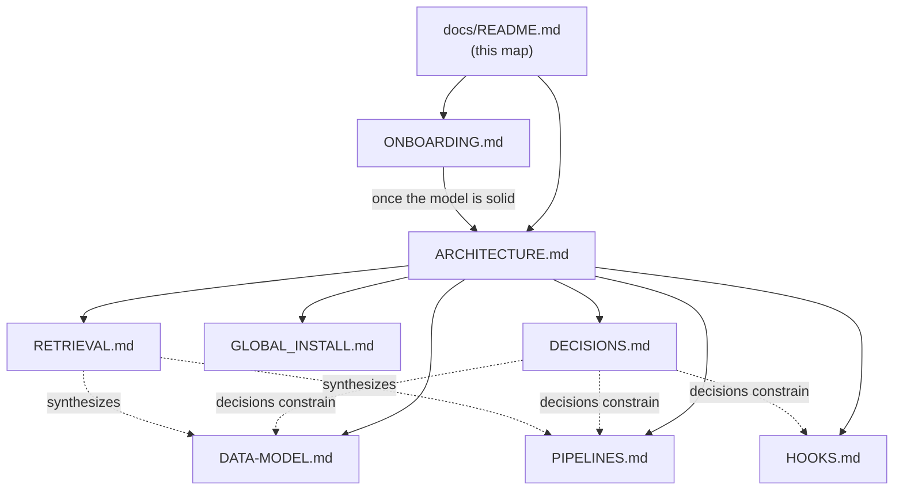

# Second Brain: documentation map

> Index. For everyone. Start here. There are two audiences and two doors: new users go to onboarding, maintainers go to the internals docs.

Second Brain is a single-user note vault that runs inside Claude Code. It has a Markdown wiki (`wiki/`), a SQLite index (`brain.db`), Python engines (`scripts/`), and four hooks (`.claude/hooks/`) wired together. You drive it by talking to Claude; hooks act on your behalf between turns.

This page routes; it does not host. Each doc below owns its facts, so follow the link rather than expecting a summary here.

---

## Two doors

**New here? → [ONBOARDING.md](ONBOARDING.md).** The mental model, the interaction idiom (you type natural language, skills fire), the first-result "aha," and what happens automatically. Start there and nowhere else.

**Maintaining or modifying this? → [ARCHITECTURE.md](ARCHITECTURE.md).** The system's shape, the hard invariants, and where to look when it breaks. Assumes you've done the onboarding.

---

## The doc set

| Doc | Read it to learn |
|---|---|
| [ONBOARDING.md](ONBOARDING.md) | What the system is, how to drive it, first success, what the hooks do automatically |
| [ARCHITECTURE.md](ARCHITECTURE.md) | How the pieces fit; the invariants a refactor must not break; failure modes and `--doctor` |
| [DATA-MODEL.md](DATA-MODEL.md) | The `brain.db` schema (10 tables, FKs, config keys, embedding format, locking) plus `team.db`, the separate team-brain index |
| [RETRIEVAL.md](RETRIEVAL.md) | Ranking + retrieval in one place: BM25 + dense + RRF, the floor, what data lives in which store, and how it flows local ↔ team |
| [HOOKS.md](HOOKS.md) | The four Claude Code hooks: triggers, timeouts, inputs, side effects, fail-open posture |
| [PIPELINES.md](PIPELINES.md) | The five core engines (ingest, hybrid search + RRF, conflicts, prune, publish) plus the team-brain layer (sync, index, hybrid retrieval, remove) |
| [GLOBAL_INSTALL.md](GLOBAL_INSTALL.md) | Global-install topology: the locator env, symlinks, settings merge, uninstall |
| [DECISIONS.md](DECISIONS.md) | The ADR index, one decision per record, with status |

---

## How the docs relate

**Suggested reading order.** New users: read [ONBOARDING.md](ONBOARDING.md), then stop. Come back when you want depth. Maintainers: read [ARCHITECTURE.md](ARCHITECTURE.md) first (invariants and system map), then the reference docs you need ([DATA-MODEL.md](DATA-MODEL.md), [HOOKS.md](HOOKS.md), [PIPELINES.md](PIPELINES.md)), with [DECISIONS.md](DECISIONS.md) open alongside to answer "why is it done this way?"

---

## Also in the repo (not part of this set)

- `CLAUDE.md`: session-time rules the agent must follow. Living doc.
- `wiki/meta/r1-verdict.md`: why Tier-1 (thinking-block) citation scoring is disabled.
- `seed/README.md`: the **seed pack** format. No pack ships with Hera; the doc
  describes the layout so you can build your own and load it with
  `python scripts/brain_cli.py seed_index <pack_dir>`. Its pages are pinned
  (exempt from `/brain-prune`) and lose to later user notes on contradiction.
