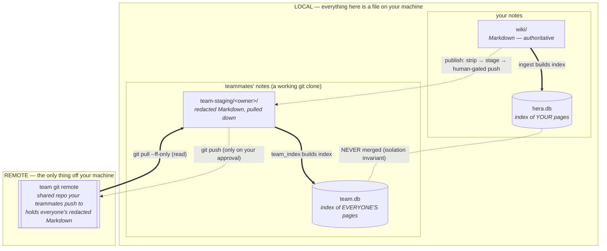
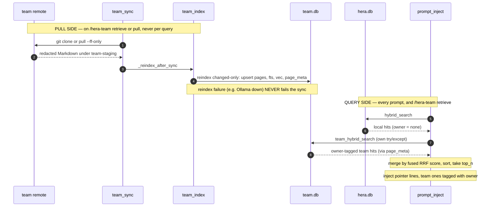

# RETRIEVAL: ranking, retrieval, and how data flows local ↔ team

> Explanation · for maintainers · assumes you've read the [mental model](ONBOARDING.md#1-what-this-is) and know what a page / ULID / citation is.
> Nature: **Living doc, orientation only.** This page ties three subsystems together and shows where data lives. It does **not** own the numbers: the RRF arithmetic and the config values live in [PIPELINES.md § hybrid search](PIPELINES.md#2-hybrid-search-scriptssearchpy) and the [config table](PIPELINES.md#config-and-thresholds-where-the-numbers-live); the schema lives in [DATA-MODEL.md](DATA-MODEL.md). When a value here disagrees with those, they win — fix this page.

Three questions this page answers in one place, because otherwise you'd stitch them together from PIPELINES §2, PIPELINES §6, and DATA-MODEL §8:

1. **How does ranking work?** — how a query becomes an ordered list of pages.
2. **Where does the information live?** — which store holds content, which holds the index, and which of them are local files on your machine vs the one shared git remote.
3. **How does data flow between your vault and the team vault?** — the pull → index → fuse path.

---

## 1. The ranking model (read this first)

Ranking is **two retrievers fused into one order.** A query runs against two independent indexes of the same pages — a keyword index (BM25) and a meaning index (dense vectors) — each producing its own ranked list. Those two lists are merged with **Reciprocal Rank Fusion (RRF)**: a page's score is the sum of `1/(k + rank)` over each list that ranked it. A page that both retrievers like ranks higher than one only a single retriever found. After fusion, anything below a **relevance floor** is dropped, and the top few survive. The same fusion math runs over your personal index and over the team index, on the same scale, so a teammate's page and your own page compete fairly for the same slot.

Nothing about ranking is learned per query — the embedding model and the fusion constant are fixed. What *does* move over time is the underlying page set (ingest adds, prune archives) and, indirectly, which pages you cite (citations drive prune, prune changes what's retrievable).

---

## 2. The two retrievers and RRF

Both retrievers read the same pages, indexed two ways in `hera.db`. `search.hybrid_search(conn, query)` runs them and fuses the results.

```mermaid
flowchart LR
  Q(["query text"]) --> EMB["embed&#40;query&#41;<br>Ollama nomic-embed-text, 768-dim"]
  Q --> TOK["tokenize:<br>\\w+ tokens, len &ge; 2, OR-joined"]
  TOK --> BM["BM25 over pages_fts<br>&#40;lower bm25&#40;&#41; = better&#41;"]
  EMB --> VEC["cosine KNN over pages_vec<br>&#40;lower distance = nearer&#41;"]
  BM --> RRF["_rrf_fuse:<br>score = &Sigma; 1/&#40;k + rank&#41;"]
  VEC --> RRF
  RRF --> FLOOR["drop score &lt; floor,<br>skip archived pages"]
  FLOOR --> OUT(["&le; top_n Hits"])
```

- **BM25 half** (`_fts_hits`) runs `bm25(pages_fts)` joined through `pages_fts_map` (rowid → page_id). The query is split into `\w+` tokens ≥ 2 chars, each quoted as a phrase and OR-joined, so it's a bag-of-words match on *any* term. A malformed FTS query fails safe to no hits.
- **Dense half** (`_vec_hits`) embeds the query via Ollama `nomic-embed-text` (768-dim — matches `pages_vec FLOAT[768]`) and runs a `sqlite-vec` KNN, nearest first.
- **RRF** (`_rrf_fuse`, shared by local and team search so the math lives in one place) uses **1-based positional ranks**, not the raw `bm25()`/`distance` values. Constant `RRF_K = 60`.
- **Floor + archived filter.** After sorting, hits below the floor are dropped, and each surviving page is re-checked with `archived_at IS NULL`, so pruned pages never resurface.

The exact arithmetic, the fail-safe behavior, and the derivation of `k=60` / the floor are in [PIPELINES.md § hybrid search](PIPELINES.md#2-hybrid-search-scriptssearchpy). The tunable values (`inject_relevance_floor`, `inject_top_n`, etc.) and their homes are in the [config table](PIPELINES.md#config-and-thresholds-where-the-numbers-live) — this page does not restate them.

---

## 3. What lives where

**Every store lives on your own machine.** All four files below sit on local disk — the *only* thing that is genuinely elsewhere is the team git **remote** (a server your teammates share). `team.db` is not "the team's database on some server": it is a local index you build on your machine from Markdown you pulled down. What matters is not personal-vs-remote (almost everything is local) but two other splits: **content vs derived index** (Markdown is authoritative; a `.db` is a rebuildable cache of it) and **yours vs everyone's** (`hera.db` indexes only your pages; `team.db` indexes teammates' published pages — and the two `.db` files never mix).

Read the boxes as two pairs. **Left/top of `local` is yours** (`wiki/` → `hera.db`); **right/bottom is everyone's** (`team-staging/` → `team.db`). Solid arrows (`==>`) are "this file is indexed into that `.db`". Dotted arrows cross the machine boundary to the remote, and every one of them is either read-only (`pull`) or gated on your explicit approval (`publish`, `push`). The `NEVER merged` line between the two databases is the isolation invariant, spelled out in [§5](#5-the-isolation-invariant).

| Store | Kind | On disk? | Whose | Authoritative? | Holds |
|---|---|---|---|---|---|
| `wiki/` | Markdown | local | yours | **yes** (content) | Your pages. Humans/Obsidian read it directly. |
| `hera.db` | SQLite index | local (git-ignored) | yours | no (rebuildable from `wiki/`) | BM25 + vector index of *your* pages, plus citations, conflicts, and cursors (saved per-session progress markers for the scorer, not SQLite cursors). Source of truth for *rankings*, not content. |
| `team-staging/<owner>/` | Markdown | local (a git clone) | everyone's | **yes** (team content) | Redacted pages pulled down from the remote, one folder per publisher. |
| `team.db` | SQLite index | local (git-ignored) | everyone's | no (rebuildable from staging) | BM25 + vector index of *everyone's* published pages, plus `page_meta` attribution. Built on your machine — never lives on the remote. |
| team git **remote** | git repo | **remote** | shared | **yes** (shared truth) | The one off-machine store. `team-staging/` clones from it (read) and pushes to it (only on your explicit approval). |

Two boundaries that a refactor must never cross:

- **`hera.db` and `team.db` are distinct local files.** `team_index.py` opens only `TEAM_DB` (`$HERA_TEAM_DB` or `<repo>/team.db`); the personal engines open `hera.db`. No team page, ULID row, or citation ever enters `hera.db`. That separation is what lets team retrieval surface *everyone's* pages without polluting your local ranking. See [§5](#5-the-isolation-invariant).
- **The machine boundary is only ever crossed by git, gated.** The one truly off-machine store is the team git remote. Content leaves your machine only through `publish.py`'s human-gated push; it arrives only through a read-only `pull --ff-only`. There is no automatic write to the remote. See [PIPELINES.md § publish](PIPELINES.md#5-publish-scriptspublishpy).

Both `hera.db` and `team.db` are runtime state (git-ignored, rebuildable) that live on your disk. The Markdown — `wiki/` and `team-staging/` — is the durable truth; the remote is the shared copy of the latter.

---

## 4. How data flows local ↔ team

The team half of retrieval has a **pull side** (bring the shared Markdown down, re-index it into `team.db`) and a **query side** (fuse team hits with local hits at ranking time). The embedding cost is paid on the pull, never per query.

**Pull side.** `team_sync.clone_or_pull()` resolves the remote from `HERA_TEAM_REMOTE` (per-machine; no fixed remote — unset means every team path is a clean no-op), clones or fast-forward-pulls into `team-staging/`, then calls `_reindex_after_sync()`. `team_index.reindex(changed_only=True)` walks `team-staging/<owner>/`, upserts `pages`/`pages_fts`/`pages_vec` plus a `page_meta(page_id, owner, source, rel_path, mtime)` row for each page carrying a ULID `id:`, re-embeds only pages whose `mtime` moved, and drops rows whose file disappeared. `team_index` is imported lazily and a reindex failure only warns — it never fails the sync.

**Query side.** Two callers fuse the two indexes with identical logic:
- **`prompt_inject.py`** (every prompt): runs local `hybrid_search`, then `team_hybrid_search` over `team.db` inside its **own** `try/except`, normalizes both into `(title, path, page_id, score, owner)`, merges by fused RRF score (same scale), takes `top_n`, and injects pointer lines — team ones tagged ` (team: <owner>)`. A missing `team.db` or a down embedder contributes nothing and never breaks injection (fail-open).
- **`team_search.py`** (`/hera-team retrieve`): the same fusion, but `--owner NAME` restricts to one teammate and excludes your personal vault (you asked for *their* view). Personal hits are labeled owner `me`, source `personal`.

**Tie-breaking.** The cross-store merge sorts by `(-score, title)` — so when a local page and a team page land on the *exact same* fused RRF score, the one whose title sorts first alphabetically takes the higher slot. Source (local vs team) is not part of the sort key, so neither side gets an edge; the title tie-break is there only to make the order deterministic and reproducible. This differs from a single store: `_rrf_fuse` (inside one index) sorts by score alone, so a true tie there keeps its incidental input order. The deterministic title tie-break exists specifically at this local↔team fusion point.

`team_hybrid_search` differs from local `hybrid_search` in exactly one way: it joins `page_meta` to attach `owner`/`source` and returns dicts (a team hit carries an `owner`; a local `Hit` does not). The retrieval substrate — BM25 + dense + `_rrf_fuse` + floor — is the same code. See [PIPELINES.md § team space retrieval](PIPELINES.md#6-team space-retrieval-scriptsteam_indexpy-scriptsteam_searchpy) and [DATA-MODEL.md § team.db](DATA-MODEL.md#8-teamdb-the-team space-index).

---

## 5. The isolation invariant

**Team content is indexed only in `team.db`; it never enters your personal `hera.db`.** This is ADR-14 and one of the hard "never do this" rules.

- `team_index.py` opens `hera_db.connect(TEAM_DB)` — reusing the connection helper (so `sqlite-vec` and WAL load) but pointed at a *different file*. It never opens `hera.db`.
- `page_meta` (owner/source/rel_path/mtime) is created only in `team.db`, never in `hera_db.SCHEMA`, so team-only columns stay out of the personal DB.
- Retrieval fuses the two DBs at *query time* by score. Fusion reads both; it merges neither store into the other.

Why it matters: if team pages leaked into `hera.db`, they would earn citations, count toward prune, and collide with your own conflicts — mixing other people's notes into your local ranking. Keeping the stores separate is what lets team retrieval surface everyone's pages while your personal ranking stays entirely yours. See [DECISIONS.md ADR-14](DECISIONS.md#2-adr-log-01-14) and [CLAUDE.md § What NEVER to do #9](../CLAUDE.md).

---

## Related / Next

- The arithmetic and fail-safe behavior of ranking: [PIPELINES.md § hybrid search](PIPELINES.md#2-hybrid-search-scriptssearchpy)
- The team sync/index/search engines in depth: [PIPELINES.md § team space retrieval](PIPELINES.md#6-team space-retrieval-scriptsteam_indexpy-scriptsteam_searchpy)
- The stores and the `team.db` schema: [DATA-MODEL.md § team.db](DATA-MODEL.md#8-teamdb-the-team space-index)
- The hooks that call search at session time: [HOOKS.md](HOOKS.md)
- The decision behind the two-DB split: [DECISIONS.md ADR-14](DECISIONS.md#2-adr-log-01-14)
- Up: [docs index](README.md)
